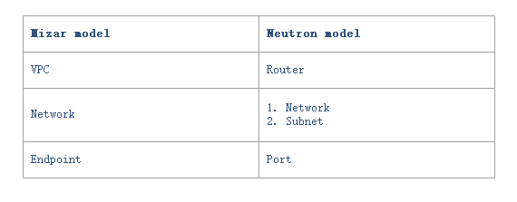
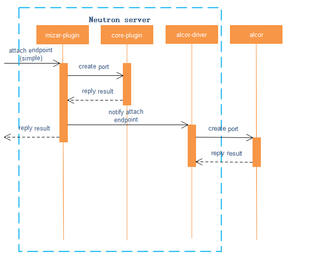
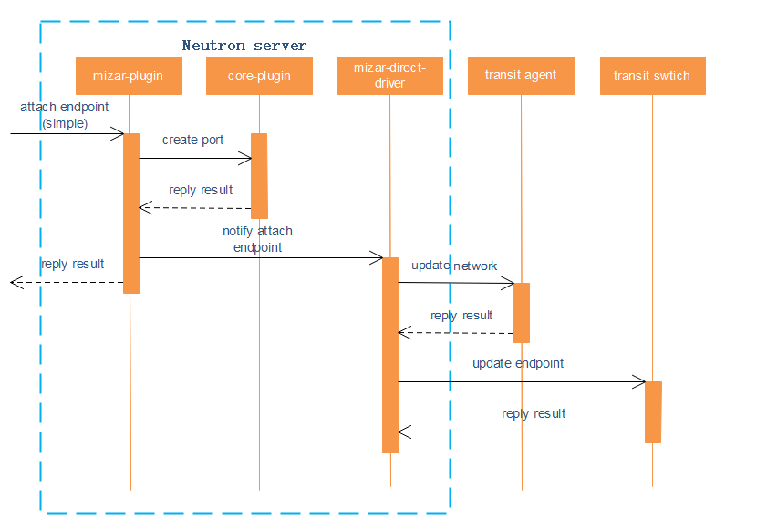

# Neutron plugin for mizar
 
Openstack is one of the most popular opensource cloud platform, of which the network function subsystem is neutron. This Document is about to explan how to design a neutron plugin for mizar, in order that compute resources provided by openstack could use the mizar network pipeline. 

neutron plugin might include two major functions: resource model save and transformation and network config distribution.

## Resource model save and transformation

The plugin should provide all operation APIs for mizar resources(vpc, network, endpoint, etc.), as the resource models of mizar are not same as neutron(router, network, subnet, port, etc.). Besides, neutron is one of the core subsystems of openstack, other core subsystems like nova may couple with neutron models. In order to make other subsystems of openstack like nova could properly interaction with neutron, when to create a mizar resource we also need to create one or more neutron resources corrspondingly. Those co-created neutron resources should only be stored, as the original neutron agents may not be needed any more and the mizar agents(transit agent, etc.) might only concern about the mizar resources.

## Network config distribution

Because alcor could take the role of the controller of mizar, there might be two choices: joint with alcor or not. 

### Joint with alcor

There would be a very thin driver for the plugin that it only need to send the resource operation to the alcor and receive the process result.

### Not joint with alcor

The driver of the plugin should independently process the mizar resource operation, and send the network config directly to the transit agent/switch/router. Those process would be very similar with that in alcor or transit controller(mizar test codes). 

