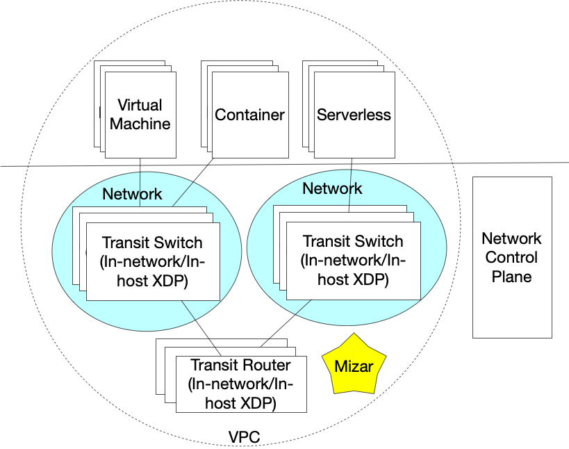

# Mizar – High Scale and High Performance Cloud Network #

Mizar is an open-source project for providing high-performance cloud network to run virtual machines, containers, and other compute workloads. We built Mizar from ground-up on top of [Geneve protocol](https://tools.ietf.org/html/draft-ietf-nvo3-geneve-08) and [XDP](https://prototype-kernel.readthedocs.io/en/latest/networking/XDP/). Mizar's main building block is an XDP program that runs on each host. The program implements virtual functions including overlay switching, routing, virtual endpoints, load-balancing, NAT, etc.

Mizar network has the following advantages:

- Support large scale of network endpoints in one cluster
- Fast network provisioning
- High network throughput and low latency
- Extendable data plane for plugin features
- Unified data plane for VM and container with VPC isolation

The following diagram illustrates Mizar's high level architecture.

Learn more about Mizar:
- [Wiki](https://github.com/futurewei-cloud/Mizar/wiki)
- [Getting Started](https://github.com/futurewei-cloud/Mizar/wiki)
- [Contributing](/CONTRIBUTING.md)

