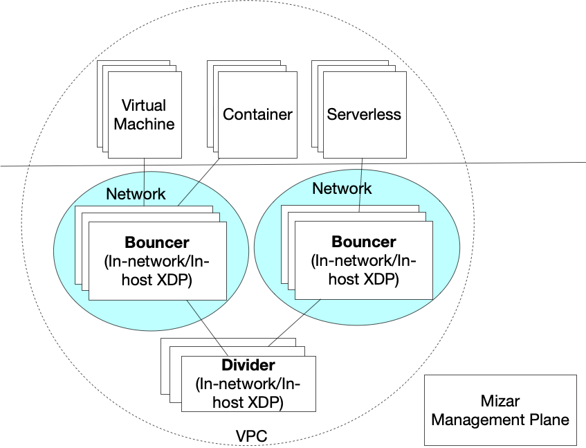

# Mizar – High Scale and High Performance Cloud Network #

Mizar is a high scale and high-performance cloud network to run virtual machines, containers, and other compute workloads. We built Mizar from ground-up on top of [Geneve protocol](https://tools.ietf.org/html/draft-ietf-nvo3-geneve-08) and [XDP](https://prototype-kernel.readthedocs.io/en/latest/networking/XDP/). Mizar's main building block is an XDP program that runs on each host. The program implements virtual functions including overlay switching, routing, virtual endpoints, load-balancing, NAT, etc.

Mizar network has the following advantages:

- Support large scale of network endpoints in one cluster
- Fast network provisioning
- High network throughput and low latency
- Extendable data plane
- Unified data plane for VM and container
- Multi-tenant isolation for traffic and address spaces

[**Learn more about Mizar**](https://mizar.readthedocs.io/en/latest/)

[Learn more about Mizar](https://mizar.readthedocs.io/)

## Community Meeting

Biweekly Mizar Sprint Planning Meeting
- Thursday at 10:30AM-12:30PM Pacific Daylight Time (biweekly, starting from April 2nd, 2020)

Resources:

- [**Mizar’s Sprint Planning Channel**](https://app.slack.com/client/TMNECBVT5/C010VLRH4SZ/thread/G0107KU0Y5Q-1585243073.003900) - 10:30AM to 12:30PM PDT 
- [**Zoom Meeting**](https://futurewei.zoom.us/j/421246133) - 10:30AM to 11:30AM PDT  (We are including a zoom meeting for the first hour.) 

## Contact Us

- [**Slack**](https://join.slack.com/t/mizar-group/shared_invite/zt-9md5gw7m-Fp8n1iV9H04Nn8P3lwTEMA)
- [**Email Group**](https://groups.google.com/forum/#!forum/mizar-cloud-networking)
