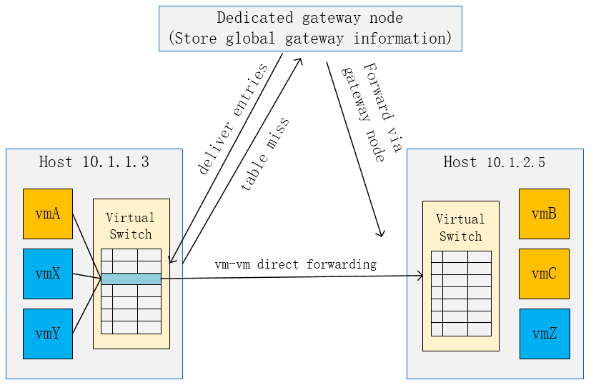
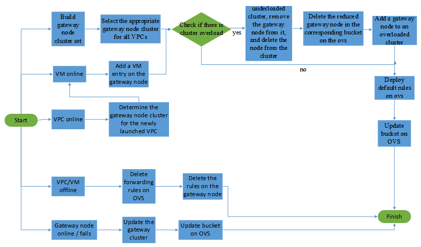
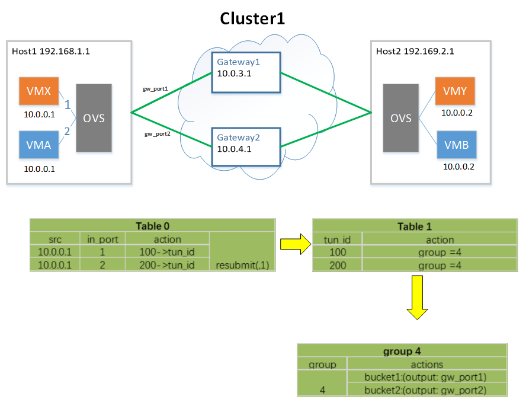
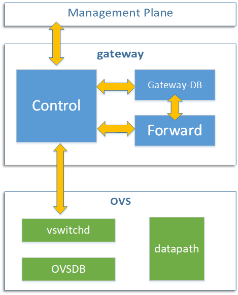

### On-demand installing of table entries based on basic gateways

#### 1. Requirements

In a cloud network, rules need to be installed on the computing nodes when the virtual machine is online. If the scale of the VPC is large, it takes a long time to get VMs online. In order to increase the speed of the virtual machine going online, it is necessary to install the rules on the computing nodes as needed. It needs to satisfy:

-   Only a small number of necessary rules are installed when the virtual machine goes online, and the remaining rules are gradually installed as needed after the virtual machine is online；

-   The size of the rules installed when virtual machine is online is decoupled from the VPC scale；

-   The number of rules deployed on the compute node is greatly reduced, reducing the risk of overload and failure of high-density servers；

#### 2. Gateway node forwarding model

In order to reduce the number of rules installed when the virtual machine is online and increase the speed of the virtual machine going online, we designe a gateway node forwarding model. Each gateway node stores the global rule information of one VPC or multiple VPCs. In the gateway node forwarding model, when a virtual machine is online, the rules configuration is mainly divided into two parts:

-   Installing the configuration related to the virtual machine to access the network, and configure the bucket-to-gateway mapping on the host-side OVS   (buckets are described below). At this point, the virtual machine has been successfully launched.

-    When the newly-launched virtual machine communicates with other virtual machines, it needs to query the rules in the OVS flow table on the computing node. Since the newly-launched virtual machine only matches the default rules for forwarding to the gateway node, the first packet of the flow will be sent to the gateway node. Then, the gateway node queries the global rules and installs the direct path rules for the OVS in the compute node  where the virtual machine is located. Then the virtual machine pairs can use direct path forwarding if the rules have been installed.

Figure 1. Gateway node model

#### 3. Gateway node cluster management

All the gateway nodes in the network are divided into several clusters of gateway nodes. The gateway nodes in the cluster are identical, which means that the rules in gateway nodes are identical. And the gateway nodes between clusters can be heterogeneous. Traffic from the same VPC will only be forwarded to the same cluster. Moreover, the number of VPCs managed by the same gateway cluster is limited, thereby improving the robustness of the network.

The main functions of the gateway node cluster management include: the initialization of the gateway node cluster, the determination of the mapping of the VPC to the bucket (gateway node cluster) and the update of the gateway node cluster.

##### 3.1 Initialization of the gateway node cluster

When the system starts to run, the gateway nodes are divided into several gateway node clusters according to the network status (e.g. the number of gateway nodes, the number of computing nodes, the estimated number of VPC). The simplest solution is to divide them equally.

##### 3.2 Select the corresponding bucket for each VPC

In order to achieve load balancing of different gateway nodes in the same cluster from the source node, a set of buckets is designed on the OVS of each computing node. The number of buckets on each computing node is the same as the number of gateway node clusters, and it corresponds to the gateway node cluster one by one, without dynamic adjustment. The bucket can send the data packet to a gateway node in the gateway node cluster corresponding to the bucket. We map the flow to different buckets at the granularity of VPC_id. We can use the flow table to forward the flow to a bucket (group rules), and then use the group rules to achieve load balancing between the gateway node clusters. Refer to the "The specific implementation of the bucket" section for details.

The mapping of flows to buckets (gateway node clusters) ensures the following principles:

-   Traffic belonging to the same VPC is mapped to a gateway node cluster, to ensure that when the VPC traffic is abnormal, only the corresponding gateway node cluster is affected, that is, the impact on other VPCs is as small as possible;

-   Each gateway node cluster manages several VPCs to ensure that the number of affected VPCs is as small as possible, when the cluster is abnormal. In addition, it can ensure that the rule information saved on each gateway node is as little as possible (Save the rules information for the  managed VPC);

-   The traffic forwarded by each gateway node cannot exceed the capacity limit of the gateway node. Later, if the corresponding gateway node cluster is overloaded due to the expansion of a certain VPC or increased traffic, the gateway node cluster needs to be expanded, that is, the mapping between the bucket and the gateway node will be updated to ensure that the gateway node is not overloaded.

##### 3.3 Update of the gateway node cluster (the update is a small probability event and does not occur frequently)

The update of the gateway node in the gateway node cluster is triggered by the following events:

-   If a gateway node cluster is overloaded, you need to expand the gateway node cluster. The specific method is to add a new gateway node to the Round Robin algorithm, which is mapping the bucket to the gateway node cluster.

-   If a gateway node fails, it needs to be deleted from the gateway node cluster, that is, from the Round Robin algorithm of bucket to gateway node cluster mapping.

-   When a gateway node is newly added, the gateway node is added to the gateway node cluster with a large load according to the current network status. At the same time, a new gateway node is added to the Round Robin algorithm for mapping the bucket to the gateway node cluster.

It is worth noting that when the gateway node cluster updats, we only update the group rule(bucket) on the computing node where the corresponding VPC is located, not all the group rules on the computing node.

Figure 2. Gateway cluster management process

#### 4. The specific implementation of bucket

We can use the group rules to implement the bucket. Specifically, we consider each group rule as a bucket, and the action buckets in the group rules store the corresponding outgoing ports of all gateway nodes in the corresponding gateway node cluster. That is, each bucket corresponds to a gateway node cluster. The number of buckets on each computing node is the same as the number of gateway node clusters. In addition, we use flow table rules to map VM to buckets.

Figure 3. Using group rules to implement buckets

We use an example to illustrate, as shown in Figure 3, VMX belongs to VPC1, VMA belongs to VPC2. The flows of VPC1 and VPC2 are arranged by us to gateway node cluster 1, which includes two gateway nodes gateway1 and gateway2. The gw_port1 and gw_port2 ports of computing node1 are respectively connected to the gateway nodes gateway1 and gateway2. Then we install a group rule on computing node1, the group identifier is 4, and the action buckets are: bucket1:output=gw_port1; bucket2:output=gw_port2. In addition, by installing a low-priority rule, the flow of the VPC1 that does not match the high-priority rule (vm-vm direct path forwarding rule) is directed to the group rule 4, so that all flow of VPC1 on computing node1 will be directed to group rule 4, which will be forwarded to gateway node gateway1 or gateway2 through the group rule 4. Through the flow table rules + group table rules, we can achieve the mapping of vpc to the gateway node cluster.

#### 5. Interface design

Key interface outline design:

The gateway node is divided into three modules: the control module, the forwarding module and the gateway_DB module.

**The control module** is mainly responsible for communication with the management plane and the compute node OVS. It includes receiving instructions from the management plane to add, delete, and modify the flow table of the gateway node; Encapsulate the corresponding flow table rule installation message and send it to OVS to install the flow table rule in OVS.

**The forwarding module** is mainly responsible for forwarding the first packet.

**The Gateway_DB module** is responsible for storing the global rule information of the VPC managed by the cluster to which the gateway node belongs.

Figure 4. Gateway module

##### 1. Interface of control and management plane:

The management plane can access the interface provided by the gateway node through RPC calls. The main function is to realize the management of global rules in the gateway node through the management plane (addition, deletion, and modification of flow tables).

-   gw_update_endpoint(ep_key, ep_msg)

    **function：**

    Maintain global rules. When the endpoint goes online or migrates, add or update the flow table information about the endpoint in the gateway_DB of the gateway node.
    

**parameter：**
    
-   ep_key: Uniquely identifies an endpoint
    
-   ep_msg: Endpoint information (such as VIP, node, network, VNI, etc.)
    
- gw_delete_vpc（vpc_key）

  **function：**

  Delete the rules of all endpoints belonging to the specified VPC in the gateway_DB of the gateway node.

  **parameter：**

  -   vpc_key: Uniquely identify a vpc

-   gw_add_vpc（vpc_key）

    **function：**

    Add the rules of the specified VPC and all endpoints belonging to the subnet of this VPC in the gateway_DB of the gateway node.

    **parameter**：

    -   vpc_key: Uniquely identify a vpc

-   gw_delete_network(net_key)

    **function：**

    Delete the rules of  all endpoints belonging to the specified network in the gateway_DB of the gateway node.

    **parameter：**

    -   net_key: Uniquely identify a network

-   gw_delete_endpoint(ep_key)

    **function：**

    Delete the rule  of the specified endpoint in the gateway_DB of the gateway node.

    **parameter：**

    -   ep_key: Uniquely identify a endpoint

##### 2. Interface of control and forward：

-   of_parse(packet)

    **function：**

    When a packet arrives at the gateway node forwarding layer, it parses the data packet, extracts keyword information (such as source IP, source mac, destination IP, destination mac, etc.), encapsulates it, and hands it to the control layer.

    **parameter：**

    -   packet: Packets received from the forwarding layer

    **return value：**

    -   of_match: Packet keyword information that the control layer can recognize

-   of_lookup_(of_match, table)

    **function：**

    According to the keyword information, the control layer searches the corresponding forwarding rule in gateway_DB.

    **parameter：**

    -   of_match: Keyword information extracted from forwarding layer packets (such as source IP, source mac, destination IP, etc.)

    -   table: Global rules saved by the gateway node

    **return value：**

    -   rule: Matching rules found

##### 3. Interface of control and OVS-vswitchd：

-   of_flow_mod(dp, rule)

    **function：**

    Used to install a set of rules on the specified OVS

    **parameter：**

    -   dp: Uniquely identify a OVS

    -   rule: Flow table rules

-   of_del_flow(dp, rule)

    **function：**

    Delete a set of rules on OVS

    **parameter：**

    - dp: Uniquely identify a OVS

    - rule: Flow table rules

-   of_update_flow(dp, rule)

    **function：**

    Update a set of rules on OVS

    **parameter：**

    -   dp: Uniquely identify a OVS

    -   rule: Flow table rules

-   ovsdb_conf(dp, ovsdb_msg)

    **function：**

    Used to configure the specified OVS switch (such as establishing a tunnel between OVS).

    **parameter：**

    -   dp: Uniquely identify a OVS

    -   ovsdb_msg: Configuration information

-   ovsdb_del_conf(dp, ovsdb_msg)

    **function：**

    Used to delete the specified OVS switch (such as deleting a tunnel between OVS).

    **parameter：**

    -   dp: Uniquely identify a OVS

    -   ovsdb_msg: Configuration information to be deleted

-   of_creat_default_rule(dp, rule)

    **function：**

    Used to install a set of default rules for a new virtual machine on the specified OVS switch.

    **parameter：**

    -   dp: Uniquely identify a OVS

    -   rule: Flow table rules

-   of_update_bucket(dp, group_rule)

    **function：**

    Used to create or update buckets (group rules) on the specified ovs switch when the virtual machine goes online or the gateway node cluster expands or shrinks.

    **parameter：**

    -   dp: Uniquely identify a OVS

    -   group_rule: Group table rules

    **Implementation ideas：**

    When the gateway node cluster is expanded or reduced, the computing node side where the VPC corresponding to the cluster is located updates the bucket (group table), and deletes or adds the expanded and reduced gateway node from the bucket.

    When the virtual machine is online, if the computing node where the virtual machine is located does not have a bucket corresponding to the VPC, add a bucket (group rule) on the ovs side of the computing node to direct the flow of the vm to the corresponding gateway node cluster.

##### 4. Key functions of gateway node cluster management in Management Plane：

-   create_cluster_set(gw_total_set)

    **function：**

    The initial network management node set will be divided into multiple gateway node clusters.

    **parameter：**

    -   gw_total_set: Initial gateway node set

-   update_cluster_set(gw_key)

    **function：**

    Update the gateway node.

    **parameter：**

    -   gw_key: Uniquely represents a gateway node

-   create_cluster (gw_set)

    **function：**

    New gateway node cluster.

    **parameter：**

    -   gw_set: Gateway node set

-   del_cluster (cluster_key)

    **function：**

    Delete the gateway node cluster.

    **parameter：**

    -   cluster_key: Uniquely represents a gateway node cluster

-   detect_overload_cluster (cluster_set)

    **function：**

    Check whether there is an overloaded cluster in the gateway node cluster set.

    **parameter：**

    -   cluster_set: Gateway node cluster set

    **Implementation ideas：**

    Check the number of VMs managed by each cluster. If the average number of VMs managed by each gateway node is greater than the threshold, it is determined to be overloaded.

-   detect_underload_cluster (cluster_set)

    **function：**

    Check whether there is an underloaded cluster in the gateway node cluster collection.

    **parameter：**

    -   cluster_key: Uniquely represents a gateway node cluster

    **Implementation ideas：**

    Check the number of VMs managed by each cluster. If the average number of VMs managed by each gateway node is less than the threshold, it is determined to be underloaded.

-   detect_failed_gw (gw_set)

    **function：**

    Check whether there is a failed node in the gateway node set.

    **parameter：**

    -   gw_set; Gateway node set

-   is_cluster_empty (cluster_key)

    **function：**

    Check whether the VPC managed by the gateway node cluster is empty.

    **parameter：**

    -   cluster_key: Uniquely represents a gateway node cluster

-   vpc_set_map_to_cluster (vpc_set, cluster_set)

    **function：**

    When the system starts running, determine the appropriate cluster of gateway nodes for each vpc.

    **parameter：**

    -   vpc_set: vpc set

    -   cluster_set: Gateway node cluster set

-   vpc_map_to_cluster (vpc_key, cluster_set)

    **function：**

    When a vpc goes online, determine the appropriate gateway node cluster for the vpc.

    **parameter：**

    -   vpc_key: Uniquely identify a vpc

    -   cluster_set: Gateway node cluster set

    **Implementation ideas：**

    When a new VPC goes online, select a gateway node cluster with the most remaining processing capacity.

-   add_gw_to_cluster (gw, cluster_key)

    **function：**

    Add a gateway node to the gateway node cluster cluster.

    **parameter：**

    -   gw: Gateway node

    -   cluster_key: Uniquely represents a gateway node cluster

-   del_gw_from_cluster (gw, cluster_key)

    **function：**

    Delete a gateway node in the gateway node cluster.

    **parameter：**

    -   gw: Gateway node

    -   cluster_key: Uniquely represents a gateway node cluster
