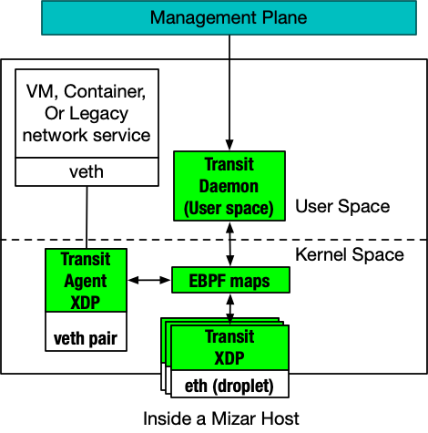
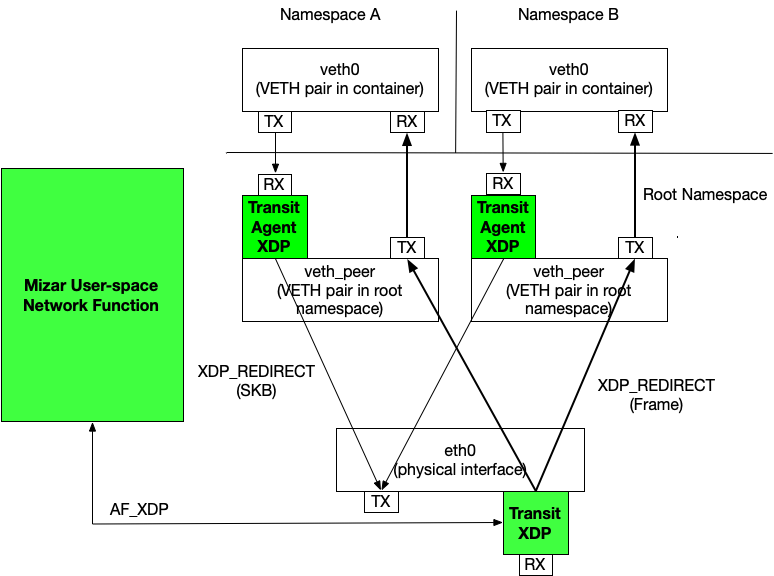

Mizar's data-plane is the core engine behind its scalability, performance, and programmability. The data-plane is primarily a group of XDP programs. Before diving deep into how the data-plane works, we need to introduce the essential architectural elements of Mizar:

* **Droplet**: a physical interface on a host with an IP to the substrate network. In the typical case where a host has a single interface, a droplet represents the host.
* **Transit Agent**: an XDP/ebpf program that processes an endpoint egress traffic. The transit agent is attached to the veth-pair of an endpoint in the root namespace.
* **Transit XDP**: the main XDP program that processes **all** ingress traffic to a droplet. The transit XDP program is extensible to support several data-plane functions, including interacting with user-space networking programs.
* **Transit Daemon** A user-space program that interfaces with the management plane. The daemon primarily passes configuration to the Transit XDP and Transit Agent by updating ebpf maps. It provides RPC services to the management plane to pass these configurations. Additionally, the daemon provides services, including controlling kernel networking through the Netlink interface, programming other components on the host as needed (e.g., OpenVSwitch). Please refer to the [management plane design](management_plane.md) for details on the Transit Daemon functionalities. Users can also interact directly with the transit daemon through a CLI program, which may run on the same host of the daemon or from a remote machine. The primary usage of the CLI program is for testing and troubleshooting.

The following diagram illustrates the architecture of a Mizar host (droplet(s)):

## Packet Forwarding (Ingress/Egress)

On the ingress path, the Transit XDP program determines if the host shall process the packet. The packet may be redirected to an endpoint (container/VM) or a user-space network function. Packets are redirected to the TXQ of the veth pair of the endpoint after decapsulation bypassing the host network stack __in the root-namespace__. Packets destined to a network function may be processed by another XDP program through a tail-call or by redirecting the packet to an AF_XDP socket. This approach has the advantage of making use of hardware offloading to processing packets entirely or in part.

The Transit XDP programs and the transit daemon provides mechanisms to program the decisions of packet processing for network functions through RPC interfaces.

The transit agent processes all egress packets of an endpoint. TX packets from an endpoint are typically encapsulated and sent to another host. In that case, the transit agent redirects the packets to the main interface of the host configured in the transit agent's metadata. If the packet's destination is another endpoint on the same host, the transit agent simply invokes the Transit XDP program through a tail call, which redirects the packet to the veth interface of the destination endpoint (on the same host).

The following diagram illustrates typical packet forwarding in a Mizar droplet.

