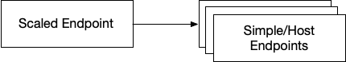

<!--
SPDX-License-Identifier: MIT
Copyright (c) 2020 The Authors.

Authors: Sherif Abdelwahab <@zasherif>
         Phu Tran          <@phudtran>

Permission is hereby granted, free of charge, to any person obtaining a copy
of this software and associated documentation files (the "Software"), to deal
in the Software without restriction, including without limitation the rights
to use, copy, modify, merge, publish, distribute, sublicense, and/or sell
copies of the Software, and to permit persons to whom the Software is
furnished to do so, subject to the following conditions:The above copyright
notice and this permission notice shall be included in all copies or
substantial portions of the Software.THE SOFTWARE IS PROVIDED "AS IS",
WITHOUT WARRANTY OF ANY KIND, EXPRESS OR IMPLIED, INCLUDING BUT NOT LIMITED
TO THE WARRANTIES OF MERCHANTABILITY, FITNESS FOR A PARTICULAR PURPOSE AND
NONINFRINGEMENT. IN NO EVENT SHALL THE AUTHORS OR COPYRIGHT HOLDERS BE LIABLE
FOR ANY CLAIM, DAMAGES OR OTHER LIABILITY, WHETHER IN AN ACTION OF CONTRACT,
TORT OR OTHERWISE, ARISING FROM, OUT OF OR IN CONNECTION WITH THE SOFTWARE OR
THE USE OR OTHER DEALINGS IN THE SOFTWARE.
-->

Mizar's data-plane adopts a simple data model that is essential to extend its
functionality. The data-model is independant of the API definitions of the
management-plane. Typically, different management plane implementations that
incorporated Mizar as its data-plane has a shim layer that translates
management-plane data-model into Mizar's constructs. The model consists of
endpoint, network, and VPC constructs.

### VPC

A VPC is the conventional Virtual Private Cloud construct that is primarily
defined by a CIDR block within a region. The VNI of the Geneve header uniquely
identifies the VPC. A network function must belong to a VPC, where the VNI
provides the primary logical separation mechanism used to support multi-tenancy.
One or more dividers divides traffic within a VPC among multiple networks. The
following fields define a VPC data-model.

- **vni**: Unique ID of the VPC that shall represent the Geneve VNI. At the
  moment, the most significant 64-bits of the vni uniquely identifies an
  administrative domain (e.g., single-tenant), and the least significant 64-bits
  uniquely identifies a VPC of a **tenant**.

- **cidr**: The CIDR block of the VPC.

- **dividers IP**: A list of the IP address of the dividers of the VPC.

### Endpoint

An endpoint is a logical representation of an overlay IP within a network and a
VPC. The IP must belong to a CIDR of a network, hence the CIDR of the VPC. The
endpoint is also identified by a type, that determines how Bouncers to processes
traffic before sending it to an endpoint. The following fields define an
endpoint:

-  **type**: {Simple, Scaled, Proxied}
-  **IP**: Endpoint IP (V4/V6)
-  **tunnel protocol**: {VxLan, Geneve}

- **Remote IPs**: A list of IP addresses that represents the host(s) of the
  endpoint. In the case of Simple endpoint, this is the IP of the endpoint's
  host.
- **Endpoint Geneve Options**: A list of custom Geneve options that shall be
  attached to the tunnel packets of the endpoint to realize and application.
- **Remote Selection Function**: The function used to select the remote IP
  mapping the endpoint {hash, colocated}.
- **Bypass Decapsulation**: A flag indicates that the endpoint is allowed to
  receive tunnel packets as is without decapsulation

#### Simple Endpoint Type

This is the fundamental endpoint type, which is analogous to a conventional
virtual interface of a container or a virtual machine. A simple endpoint has a
1:1 mapping to a host or a network function (tunnel interface). Traffic
ingressing to a simple-endpoint is decapsulated and forwarded to a single tunnel
interface or a network function. The following figure illustrates the remote
association of a simple endpoint.

#### Scaled Endpoint Type

A scaled endpoint has a 1: N mapping to N end-hosts or network functions. A
Bouncer processes traffic to a scaled-endpoint to one of its remote IPs by
typically hashing the 5-tuples of the inner packets. The control-plane may
configure other selection functions to determine the final packet destination.
This is useful in implementing scalable network functions such as Layer-4 load
balancers, or a NAT device. The following figure illustrates the remote
association of a scaled endpoint.

#### Proxied Endpoint Type

A proxied endpoint has a 1:1 mapping to another endpoint. The other endpoint can
be simple, scaled, or proxied endpoint. Fundamentally a proxied endpoint
provides the underlying packet forwarding mechanisms required to implement VPC
endpoints. The following figure illustrates the remote association of a proxied
endpoint.

#### Network

Mizar defines a network in a broader term as a compartment of multiple
endpoints. Conventionally a network is a subset of specific CIDR block from the
VPC CIDR block, but the data-model allows defining the networks as a group of
endpoints that don't necessarily share IP address from the same CIDR block. A
network represents the logical separation where flow experiences a minimal
number of hops. To support various use cases for both conventional VMs,
Containers, and future compute types, Mizar primarily supports two types of
networks:

1. **subnet**: This is classical VPC subnets defined by a CIDR block of the
   network must fall within the CIDR space of the VPC. An endpoint belongs to
   the subnet that has the longest prefix match.
2. **group**: This is a new logical network defined by a label. Endpoints can
   join and leave a group-network dynamically according to group policies. When
   an endpoint is permitted to join a group-network, the outer header of the
   encapsulated packet will have a Geneve option that contains the group-label
   which allows network functions to make decisions based on group-network
   memberships.

- **cidr**: The CIDR block of the subnet (a subset of the VPC CIDR).
- **bouncer IP**: The IP address of the bouncers of the network.
- **group ID**: The group ID of a network of type group (zero otherwise).