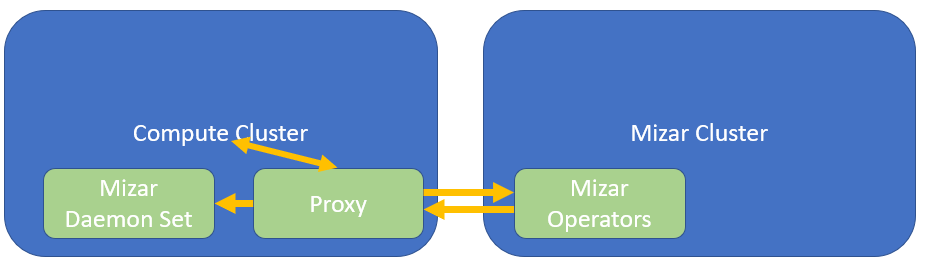

<!--
SPDX-License-Identifier: MIT
Copyright (c) 2020 The Authors.

Authors: Hong Chang        <@Hong-Chang>

Permission is hereby granted, free of charge, to any person obtaining a copy
of this software and associated documentation files (the "Software"), to deal
in the Software without restriction, including without limitation the rights
to use, copy, modify, merge, publish, distribute, sublicense, and/or sell
copies of the Software, and to permit persons to whom the Software is
furnished to do so, subject to the following conditions:The above copyright
notice and this permission notice shall be included in all copies or
substantial portions of the Software.THE SOFTWARE IS PROVIDED "AS IS",
WITHOUT WARRANTY OF ANY KIND, EXPRESS OR IMPLIED, INCLUDING BUT NOT LIMITED
TO THE WARRANTIES OF MERCHANTABILITY, FITNESS FOR A PARTICULAR PURPOSE AND
NONINFRINGEMENT. IN NO EVENT SHALL THE AUTHORS OR COPYRIGHT HOLDERS BE LIABLE
FOR ANY CLAIM, DAMAGES OR OTHER LIABILITY, WHETHER IN AN ACTION OF CONTRACT,
TORT OR OTHERWISE, ARISING FROM, OUT OF OR IN CONNECTION WITH THE SOFTWARE OR
THE USE OR OTHER DEALINGS IN THE SOFTWARE.
-->

This doc is to discuss targets and approaches to deploy Mizar to kubernetes (k8s) and Arktos.

### Targets

- Mizar deployment for both k8s and Arktos.
- Mizar deployment in different environment including local dev environment (one VM), GCP environment (multiple VMs), AWS environment (multiple VMs).
- Mizar deployment should support factors such as multi-apiserver, multi-etcd, multi-tenant.
- Support deploy two version of Mizar: for developer and for end user.
- Mizar setup script should support update Mizar to new version.

### Requirements

- Mizar deployment should minimize the steps needed to deploy Mizar and unify the steps for different deployment environments (GCP, AWS and .etc).
- After deployment, user should be able to easily sanity check deployment result.

### Definitions

- **Mizar Phase 1**: current Mizar components are in the same cluster of k8s.

  

- **Mizar Phase 2**: Mizar is targeting to 2-cluster model. In this 2-cluster model, Mizar's management plane is running in a separate k8s cluster than Arkos compute cluster. An Arktos cluster will deploy the transit daemon and a Mizar proxy to communicate with the Mizar management plane.

  Mizar cluster should be able to run either k8s or Arktos.

  

We should produce same major deploy process for Mizar phase 1 and 2, while deploying different components.

### Environments

There are different environments that Mizar should be supporting.

- k8s Kind environment

  Typically k8s cluster can be launched by Kind. It's k8s in one VM, but with multiple nodes.

  Mizar phase 2 requires two clusters. For the two clusters, we shall test both clusters are k8s clusters, or one cluster is k8s and another cluster comes from arktos up. 

- k8s GCP environment

  kubernetes running in Google Cloud Platform.

- k8s AWS environment

  kubernetes running in AWS.

- arktos-up environment

  Arktos running in one machine in one node mode. It's typical Arktos environment for dev and test.

- Arktos GCP environment - single master

  Arktos running in GCP. It has one master node and multiple worker nodes.

- Arktos AWS environment - single master

  Arktos running in AWS. It has one master node and multiple worker nodes.

- Arktos GCP environment - multi master

  Arktos running in GCP. It has multiple API servers and multiple ETCD. Consider it has multiple master nodes.

- Arktos GCP environment with Kubemark

  Arktos running in GCP. It uses Kubemark to simulate large clusters with hundreds of nodes. It's a good environment to demonstrate Mizar performance in large clusters.

### Dev vs Prod of Mizar

All the time these should be two version of Mizar to be deployed. One is dev version and one is prod version.

- **Prod Version**, it's for end users to use Mizar in their test or prod environment. Its purpose is not to test Mizar. Instead it's to test their environment with Mizar, or check how Mizar fit their requirements, or using Mizar in their production environment. It's to deploy Mizar stable versions. We shall provide public docker images for prod version deployment. 

- **Dev Version**, it always reflects latest code of Mizar. The code can be from any branch such as master, dev-next or any private branch. In this way, while developing Mizar, developers can easily test Mizar by latest code. It's for Mizar developers with dev or test purpose. 

We plan to add continuous deployment into a test cluster. We will use Jenkins for Mizar CI/CD scenario which will make Mizar more robust.

### New Install vs Update

The deploy script should support both new install and update of Mizar. In prod environment, when there is Mizar installed, user may want to update Mizar to new version while cluster networking won't break. We need to support "Mizar update" scenario. While Mizar updating, there should be no impact or minimal/acceptable impact to the cluster.

### CI/CD

We planned Mizar CI/CD pipeline, and it will be for both prod and dev versions of Mizar. The CI/CD pipeline will test Mizar update scenario continuously.

Jenkins is a good candidate tool for CI/CD. What we planned are:

- After send pull request, unit/integration/e2e test will be launched to verify there is no regression for new code. After verification succeed, code could be merged. (CI)

- We will implement perf test and add it to CI. This is long term target which won't be in iteration 1. Depends on perf test cost, later we may decide it's not in CI which will be triggered in each pull request. Instead we may put it triggered by merge, which will reduce frequence of occur times. (CI)

- After code merged to dev-next branch, a job will be triggered to build binaries, docker images. A test cluster should be deployed and e2e test will be executed. (CD)

- After code merged to master branch, a job will be triggered to build prod binaries, prod docker images. Then end user can use the latest prod build to deploy. (CD)

### Deploy Steps

1. Binary Ready

	In the first step we need to make sure all Mizar components are in a binary ready state for deployment. 

	The docker images should be ready to download, or ready to be built, depending on it's dev or prod version. The script should verify that, or build the images.
	
2. Environment Ready

	Either it's Arktos environment, or k8s environment, it should have already be ready. Kubectl is in the path and can function well. Script needs to verify environment readness.

	For dev environment, script may or may not launch cluster. I prefer not launch cluster because cluster is not target of Mizar deployment. Mizar just lives in a ready cluster.

	For phase 2 Mizar, there should be two clusters ready. One is for k8s and one is for Mizar. We need two clusters ready.
	
3. Deploy Mizar

	In this step, Mizar needed authentication should be setup, then Mizar components should be deployed one be one if certain order is required. Following section will describe what are the components to be deployed and how.

	To be decided: components deployment should be transactional or not. Which means, if some components successfully deployed, while one component failed, whether we should roll back all the components to be undeployed.
	
4. Sanity Check

	After components deployed, scripts shall perform sanity check which should be light weighted, and only cover basic functionalities. 
  
    For prod environment, sanity check should be readonly operation.
  
    Example sanity checks:
    - k8s/Arktos is functioning well, especially in networking part.
    - Mizar components are on and working.
    - networking function is provided by Mizar.

### Components

Following components are only Mizar components which are developed by Mizar team.

To make Mizar functioning well, these components are need to be deployed to proper locations.

The deployment approach is using YAML file and then components will be deployed and running in the pods.

**Mizar phase 1**:

- service account etc
- Mizar Custom Resource Definition (CRD)
- Daemon Set
- Operators

**Mizar phase 2**:

- service account etc
- Mizar Custom Resource Definition (CRD)
- Daemon Set deploys to compute cluster
- Mizar Proxy deploys to compute cluster
- Operators deploy to Mizar cluster
- GRPC server/client deploy to both compute cluster and Mizar cluster

### Script

The result of the deployment work should be bash script. If possible, there should be a generic script with multiple parameters. For example, "./deploy-mizar.sh dev arktos" means deploy Mizar of dev version to Arktos. Hopefully environment can be auto-detected hence the "arktos" parameter is not necessary.

The script should be step splited. Each script part should map to a deploy step described above. If possible, script shall be in one file then reader doesn't need to jump to files.

Script may be different for Mizar phase 1 and phase 2, but script parts (deploy steps) keep the same.

### Success Criteria

This is a check list. The deployment work is done after all items checked.

- [ ] Mizar deployed to k8s Kind environmen
- [ ] Mizar deployed to k8s GCP environment
- [ ] Mizar deployed to k8s AWS environment
- [ ] Mizar deployed to arktos-up environment
- [ ] Mizar deployed to Arktos GCP environment - single master
- [ ] Mizar deployed to Arktos AWS environment - single master
- [ ] Mizar deployed to Arktos GCP environment - multi master
- [ ] Mizar deployed to Arktos GCP environment with Kubemark
-
- [ ] script is ready for "Binary Ready"
- [ ] script is ready for "Environment Ready"
- [ ] mscript is ready for "Deploy Mizar"
- [ ] script is ready for "Sanity Check"
-
- [ ] deploy Mizar daemon component 
- [ ] deploy Mizar operator component
- [ ] deploy Mizar proxy component
-
- [ ] prod yaml files are ready for download
- [ ] prod images are versioned and uploaded to docker hub
- [ ] prod proxy binaries are ready for download
-
- [ ] script can deploy Mizar to environment that old Mizar exists
- [ ] verify k8s network won't break during updating Mizar
-
- [ ] Jenkins is configured to run CI/CD
- [ ] Setup pr test for unit test and integration test
- [ ] For dev-next branch, setup job to build binaries and docker image, and run test deploy
- [ ] For master branch, setup job to build prod binaries and prod docker image
-
- [ ] "how to deploy" doc is ready
- [ ] Verify someone can follow doc and deploy successful