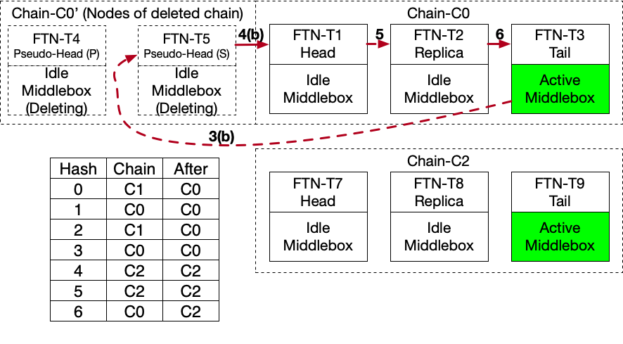

# Mizar: Distributed Flow Table and Scaled Endpoint Design

This is a strawman design for the Distributed Flow Table and Scaled
Endpoint in which we detail its essential design techniques:

-   Modular middleboxes with XDP programs that are chained to form
  various types of network service decisions

-   Local shared configuration across multiple XDP programs that reduces
  the need for a packet to traverse multiple nodes to make a
  decision on a new flow

-   Overlay protocol integrated within the data-plane to provide
  consistent connection state

-   Built-in multi-tenancy that allows infrastructure sharing of network
  services and middleboxes without the need to isolate middleboxes in
  virtual machines or containers, hence improves cost

-   Native data-plane failure detection that minimizes the time to
  recover a connection by means of gossip protocols

# Software Organization

We will manage two separate pools of nodes. The
first pool consists of data-plane nodes (D-Nodes) that are responsible
for all packet processing. The other pool consists of management-plane
nodes (M-Nodes) that run a set of Kubernetes custom resource operators
and Kubernetes services . The operators implement the management-plane logic,
and the other services cooperate with the operators to manage the
D-Nodes and the middleboxes as we will detail in the Management Plane
Section. The D,M-Nodes may join and leave the cluster dynamically,
and the D-Nodes are not necessarily Kubernetes worker nodes and can
be external to a Kubernetes cluster.

The management-plane exposes network services as endpoints of a single
IP address (VIP), each implements a chain of one or more middleboxes.
We refer to such network service as (Scaled Endpoint),as an endpoint
scale-out and in across multiple D-Nodes according to its bandwidth
demand. The following is a non-exhaustive list of potential Scaled
Endpoint types: Bouncer, Divider, Load-balancer, Nat, DPI, QoS,
Tunnel, Firewall, Protocol Translators IPv6/IPv4, Access Control List
(ACL) or a combination of these. A typical example from production
systems is a Scaled Endpoint that implements a secure load-balancer
and consists of two middleboxes: ACL Loadlancer). Developers shall
be able to specify and verify different Scaled Endpoints
functionalities through a specification interface.

# Dataplane Nodes

D-Nodes (Figure [1] are Virtual Machines (VMs) or SmartNiCs
that support turnkey Linux distributions or XDP offloading
(e.g., Broadcom PS225 , Netronome Agilio. Each D-Node may
have multiple network interfaces. The management-plane abstracts
network interfaces as droplets running on the D-Node. A droplet is
a one-to-one mapping to a network interface. A droplet daemon
(droplet-d) manages the dropletswhere it attaches an XDP program to
each interface, populates ebpf maps storing configuration, flow-caching,
and metrics. The droplet-d also manages data plane userspace
middleboxes, where packet processing may be offloaded to the userspace
using AF XDP. The D-Nodesalso deploy a nomad driver and device plugins
that extends Nomad/Consul  for health checks, telemetry, placement, and
autoscaling. In the case of SmartNics, the D-Node's management plane
components may be deployed to a common server -- installing multiple
SmartNics -- which acts as aproxy to manage the dataplane through an RPC interface.

Figure 1: Dataplane Node Worker Architecture

# Droplet Organization

Each droplet runs an XDP program that implements the data-plane
functions (Figure [2]. The droplet's XDP program
consists of a Primary XDP (P-XDP) program that performs initial packet
classification and invokes middlebox functions. A middlebox is an
ebpf program (M-XDP) that implements ClickOS like middleboxes and
elements. The most important elements for most of the network
services are the IPRewriter, IPClassifier, and IPFilter. We
introduce two new M-XDP types that are specific to the cluster
functionalities; Forwarder (FWD) and Flow Table Node (FTN)

Figure 2: Droplet Architecture

An M-XDP entirely runs in the kernel or offloaded to a SmartNIC. For
some complex middleboxes , may send packets to userspace through AF
XDP in case the D-Node is a Virtual Machine. The P-XDP and M-XDPs all
share the same ebpf maps. The management plane provides packet
classification rules by which a P-XDP determines which M-XDP shall
handles the packet and tail-calls the corresponding ebpf program. A
droplet also maintains a set of ebpf maps shared with all P-XDP and
M-XDP programs. The maps have four categories:

-   **Flow maps (f-map)**: Read/Write maps used by middleboxes to
  read/write flow status. A typical flow map tracks the IP rewrite
  rules of a flow and the connection status with a flow entry such as:

*(saddr, sport, daddr, dport, protocol, vni) −→ (saddr , sport , daddr , dport , protocol , vni , conntrack)*

where *saddr* is the source IP address, *daddr* is the destination IP
address, *sport* is the source port, *dport* is the destination port,
*protocol* is the protocol number, and *vni* is the virtual network
identifier. The symbol indicates a modified value of the packet's
field and *conntrack* is a flag that tracks the connection state (e.g.
closing). There are several types of f-maps that we will detail as we
describe specific use cases.

-   **Configuration maps (c-map)**: Read only maps storing configuration
  of different network service and middlebox configuration. Only the
  droplet-d writes to c-maps and P-XDPs and M-XDPs only read
  configuration from c-maps. We will describe several types of c-maps
  throughout the text.

-   **Jump table (j-map)**: A jump table that maps an M-XDP index to its
  ebpf file descriptor (*index fd*) such that the P-XDP use to invoke
  M-XDPs and M-XDPs use to invoke each others.

-   **Metering maps (m-map)**:
  Read/Write maps used by middleboxes to provide packet and health
  metrics.

# Management Plane Nodes

Users, administrators, and management plane operators interact with a
the cluster through the Kubernetes API server. Through
Custom Resource Definition , we extend the API
server functionalities to manage new types of objects.
Each object has a custom resource operator that
manages its life-cycle from creation, to provisioning, to deletion
through various workflows. An administrator deploys an operator as a
pod, that's integrated in the control-loop of Kubernetes.

The management-plane employs a Nomad and Consul clusters to provide
off-the-shelf services for large scale clusters of several thousands
D-Nodes. Similar to operators, an administrator shall deploy
Nomad/Consul clusters as Kubernetes Pods. Nomad exposes
functionalities to operators for placement and autoscaling of various
components. Consul provides automatic discovery of D-Nodes, where a
D-Node may dynamically join or leave the data-plane pool. It also
provides health checking service through gossip protocol, that allows
the cluster to discover newly

Nomad/Consul manage production clusters of more than 10,000 nodes.
bootstrapped nodes. Also, the D-Nodes shall use Consul's gossip
protocol to rapidly detect of health status changes of other nodes; an
important feature for rapid failure recovery entirely in the
data-plane protocols. Moreover, the health checking service allows
various operators to rapidly activate workflows to replace faulty
nodes.

# Architecture

The data-plane consists of two layers; A Distributed Flow Table (DFT)
and Forwarders (FWDs). Forwarders are horizontally scaling M-XDPs over
multiple droplets that share no flow-state. The DFT is a group of FTNs
(an M-XDP type) organized as chains (Figure [3], where
each chain consists of FTNs that replicates flow entries using a chain
replication protocol. The following diagram illustrates a DFT with
three chains, each consisting of 3 replicas and *N* FWDs forming the
forwarding layer. FTNs within a single chain execute a
custom chain replication protocol to maintain a
consistent flow states across the chain's replicas. Unlike existing
failure recovery techniques, the DFT
embeds the replication protocol headers in the outer header of the
packets so that there is no delay in packet transfer for any FTN or
FWD (with most existing failure recovery techniques, the read queries
are dropped during replication process, thus, delays packet transfer).
Moreover, the DFT scales out/in the number of chains to match the
connections rate in the cluster, here we use the Maglev consistent
hashing algorithm  to (re)partition flow entries
across multiple chains.

Figure 3: DFT Architecture

**DFT and FWD management:** FWD and DFT operators place FWDs and FTNs
as droplets utilizing the pool of D-Nodes. A droplet can be a FWD or
an FTN, and FTN and FWD cannot co-exist on the same D-Node(note:
multiple FWDs can share the same D-Node, but each must be placed on a
separate droplet). Droplets that implement FTNs also load all
middleboxes that the cluster supports as M-XDPs. All M-XDPs are idle
except the one collocated with the tail FTN. For example, in the above
diagram, the middleboxes collocated with FTN-T3, T6, T9 are all active
(shown in green). The number of FTNs within a chain is static for a
single DFT. A single chain has a minimum of two FTNs. The DFT operator
designates one of the FTNs in a chain as a tail node, one as head and
the remaining nodes - if any as replicas. For example, Chain-C0 in
the previous diagram has FTN-T1 as head, FTN-T2 as a replica, and FTN-T3
as a tail. The number of chains can increase and decrease for scale
out/in. The DFT operator maintains the Maglev hashing table and
propagates the table to FWDs or any other entity that may communicate
with the DFT (e.g., host nodes, other operators).

# Scaled Endpoint and Forwarder Selection
A Scaled Endpoint spans multiple FWDs and the FWD selector terminates
flows designated to a scaled endpoint to one of its FWDs. The Scaled
Endpoint operator places and scales out/in a Scaled Endpoint on
multiple FWDs given its bandwidth requirement. Scaled Endpoints belong
to different tenants and multiple Scaled Endpoint types share the same
FWDs. For example (Figure [4], the Scaled Endpoint
operator places Mizar's bouncers of one tenant's network on a group of
FWDs that also share a load-balancer of another tenant. A FWD selector
can be a data-center router (e.g. using ECMP protocol), a software
switch on the host/vm (e.g. OVS using group selection hashing), or an
ebpf program on the egress path of a VM or container. This approach
ensures that we can deploy with legacy cloud
networks as well as state-of-the art host networking approaches.

Figure 4: Scaled Endpoint

The Scaled Endpoint operator keeps routers, or host switches updated
with the set of FWDs of a Scaled Endpoint. For example, Mizar uses a
simple tuple hashing in each Transit Agent - an XDP program that
encapsulates VMs/Container egress traffic ­ -- to select a bouncer
from a set of bouncer's FWDs. Mizar provides an RPC interface to
update this set of FWDs for each host that has a VM or container that
belongs to the same bouncer network. The same selection approach is
possible with OVS based hosts or BGP/ECMP routers. If a host uses OVS,
the Scaled Endpoint operator shall update the OVS flow rules using a
group selection whenever an FWD changes its availability. Similar to
Maglev and Katran, the Scaled Endpoint operator may also program BGP/ECMP
switches and routers by advertising FWDs using for example exaBGP.

The diagram shows four Scaled Endpoints and different types of FWD
selectors. In this example, the Scaled Endpoint operator places three
of the scaled endpoints on the FWDs, where three FWDs are shared
across the three scaled endpoints. In this case, the Scaled Endpoint
operator also programs an ECMP router to select the FWDs of one Scaled
Endpoint, OVS - on a VM host - to select the second, and an ebpf
program on another host to select the third. The fourth Scaled
Endpoint is detached, here the Scaled Endpoint operator does not
assign it to any FWD. For a detached Scaled Endpoint, a host directly
sends flows to one of the chain's tail using Maglev hashing. In the
case of a detached Scaled Endpoint, the FWDs function is built-in the
host. The benefits of a detached Scaled Endpoint are bypassing the
forwarding layer as well providing the capability to develop a custom
hashing function to select the chains. An example of a detached Scaled
Endpoint type is the Mizar Bouncer where the Scaled Endpoint
determines a destination endpoint's host which does not require
sending all packets to the bouncers. We will detail the detached
Scaled Endpoint scenario when we discuss the east/west traffic
use cases.

# Modular Network Services

We process both east-west and north-south traffic.
For east-west traffic, endpoints' packets are tunneled using
mainstream tunneling protocols (typically VxLan or Geneve). For
north-south traffic a gateway Scaled Endpoint receives external
traffic from a service provider, where the FWDs must tunnel the
packet. Within DFTs and between and FWDs, we shall use NSH to convey
packet metadata (Figure [5] 2. We don't expect the substrate network
to perform any routing decisionsbased on the service path header to
realize these functions.

Figure 5: NSH

**Scaled Endpoint Modular Programming:** The NSH's Service Path
Identifier (SPI) field identifies a Scaled Endpoint. A FWD maps
packets to SPI, where the Scaled Endpoint operator populates the
entries of a configuration map (*SPI-c-map*) in each FWD that places
the Scaled Endpoint. The packet to SPI mapping in a *SPI-c-map* is
typically (*vni, daddr, dport*) *spi*. The NSH's Service Index (SI)
identifies the Scaled Endpoint's middleboxes. The P-XDP and M-XDP use
the SPI and SI value to determine the next middlebox that shall
process a packet. As the packet progresses from one middlebox to the
next, it decrements the SI value by one or more according to a Scaled
Endpoint specification table. The Scaled Endpoint operator programs
its specification table in each of the Scaled Endpoint's FWDs and all
the FTNs of the DFT. A configuration map (*Scaled Endpoint-c-map*)
stores a mapping of SPI to its specification table.

Figure 6: Packet's Life-cycle in a Scaled Endpoint

For example, consider a Scaled Endpoint implementing a Load-balancer
(LB) behind an Access Control List (ACL). Figure [6]
shows the detailed SI values to progress the packet processing. When
the packet first arrive to droplet-2, where one of the Scaled Endpoint
FWD, the P-XDP lookups the Scaled Endpoint's spi, inserts the NSH
header, sets the header's SPI value, and the SI to 255. The packet
progresses as follows:

SI:255 Action: droplet-1's P-XDP tail-calls the ACL M-XDP

-   ACL performs stateless packet filtering and may drop the packet

-   ACL decrements SI by one

SI:254 Action: the ACL M-XDP tail-calls droplet-1's FWD

-   look up its flow cache for already existing entry for the packet's flow

-   If a flow entry exists, the FWD decrements the SI to 247, otherwise
  to 253 SI:253 Action: the FWD sends the packet to droplet-2

-   droplet-2 P-XDP look up its flow cache for already existing entry for the packet's flow

-   If a flow entry exists, the P-XDP decrements the SI to 252,
  otherwise to 251 SI:252 Action: droplet-2's P-XDP sends the packet
  to its original source (droplet-1).

-   droplet-1 P-XDP decrements SI by one

SI:251 Action: droplet-2's P-XDP tail-calls the packet to the LB M-XDP

-   determines the IP address of the backend to send the packet to

-   the LB M-XDP decrements SI by one

SI:250 Action: the LB M-XDP sends the packet to DFT head for
replication

-   the DFT update the flow entry according to the replication protocol.

-   the last DFT replica decrements SI by one

SI:249 [The SI is also used to progress the packet during replication
and the details of the protocol is omitted here for]
[brevity as we discuss its details in DFT_Internal_Protocol.

SI:248 Action: the last DFT replica sends the droplet-2 Monitoring
(MON) M-XDP

-   The MON M-XDP updates the m-maps.

-   The MON M-XDP replica decrements SI by one

SI:247 Action: the MON M-XDP sends the packet to its original source
(droplet-1).

-   droplet-1's P-XDP decrements the SI by one. SI:246 Action:
  droplet-1's P-XDP tail-calls droplet-1's FWD

-   droplet-1's FWD caches the flow entry and sends the packet to its destination.

Figure 7: Scaled Endpoint Programming Model

The Scaled Endpoint specification table enables flexible programming
of the Scaled Endpoint logic in a modular way. Most of the
specification branching will invoke M-XDP on the same droplet, with
the exception of the cases where the flow states must be updated
through the DFT. In both cases the specification itself is generic
enough so that the middlebox operator may place anywhere in a cluster.
This programming model enables a ScaledEndpoint administrator to designs
the Scaled Endpoint logic through a high
level description language. Figure [7] shows a high level
layout of this idea. The Scaled Endpoint operator takes the Scaled
Endpoint configuration - written in a high level language - and
generates a specification table. A function verifier, such as Gravel
, takes the specification table and predefined
specification of the middleboxes as inputs and provide a proof of the
correctness of the Scaled Endpoint configuration. If proved correct,
the Scaled Endpoint propagates the specification table to
the Scaled Endpoint's FWDs and DFT.

# DFT Internal Protocol

**NSH Metadata:** The following diagram illustrates the NSH
metadata structure. We designed the metadata primarily around the DFT
operations to convey the needed changes that FWDs must apply to
packets' headers. Figure [8] show the structure of the
NSH metadata, with fields:

Figure 8: DFT NSH metadata

-   Ver (3-bit): Metadata version

-   Length (5-bits): Total length of the metadata in 4 bytes increments

-   (R)everse (1-bits): Indicates DFT operations for the reverse flow

-   Reserved (23-bits): For future use and must be zero

-   FWD IP Address (32-bits): IP address of FWD to return the packet to

-   DFT operations: Variable length table operations

The DFT NSH metadata allows packing multiple DFT
operations in the same metadata header as long as there is a room in
the packet permitted by the network MTU. Figure [9]
shows the header structure of a DFT operation, with fields:

Figure 9: DFT operation

-   Op (4-bit): Metadata version

  -   0x0: Reserved

  -   0x1: Lookup

  -   0x2: Reply

  -   0x3: Update ANY

  -   0x4: Update NOEXIST

  -   0x5: Update EXIST

  -   0x6: Delete

  -   0x7-0xf: Reserved

-   Index (16-bits): Index of the ebpf map of the FTN

-   Key Len (5-bits): Key length in multiple of 4 bytes

-   Val Len (5-bits): Value length in multiple of 4 bytes

-   Key: Key payload of length (Key Len)

-   Value: Value payload of value (Val Len)

The maximum length of the key and value fits an IP + TCP headers. We
preserve the exact structure of the key and value fields as they are
related to the key and value structures of the ebpf map referred to by
Index. Typically, we shall use an optimized key as reference fields to
the inner packet header to save space in the metadata header and avoid
copying unnecessary information that already exist in the packet.

Figure 10: Regular packet flow

**Packet Flow:** Algorithm 1 and Algorithm
2 detail the FWD and FTN behaviors for packet
processing. Figure [10] describes a typical example of
the regular packet flow and interaction between the FWDs and the DFT.
The packet progresses from source to destination as follows:

1. FWD receives a packet from source
2. FWD lookup the packet's flow entry in its flow f-map (cached)
    1. If an entry exists, FWD rewrites the packet's header according to the
    flow-entry and bounce the packet back for transmission to its destination.

    2.  If no entry exists, fwd hashes the packet's tuple and selects
        the corresponding chain from the Maglev table, add an NSH header
        corresponding to the Scaled Endpoint of the packet (with a
        Lookup Opcode), then sends the packet to the tail FTN of the
        chain (FTN-T3 in Figure [10]. If the packet is not
        encapsulated (external traffic), the FWD
        encapsulates the packet.

3.  When the tail FTN receives packet 2(b), it lookup the packet flow
  entry in its flow f-map, there is two possible cases:

    1.  If an entry exists, the FTN replies with the flow entry and
        sends it to the FWD (with a Reply Opcode).

    2.  If no entry exists, we assume a new flow and the FWD tail-calls
        the first M-XDP in the Scaled Endpoint specification table. The
        specification table progresses until the final flow-entry is
        concluded, then the M-XDP adds an Update DFT operation to the
        NSH header and sends the packet to the Chain's head (FTN-T1 in
        Figure [10].

4.  The fourth packet can be either:

    1.  When the FWD receives packet 3(a), it caches the flow entry,
        rewrites the packet's header according to the flow-entry and
        bounce the packet back for transmission to destination.

    2.  When the Head FTN receives packet 3(b), there are two possible
        scenarios for the Head FTN to perform before sending packet
        4(b):

        1.  If non-expired flow-entries exists, the FTN ignores any Update
            request in packet 3(b) and resets the flow-entry expiry
            timer. This condition indicates that the tail node is
            recovering from failure, or a repartitioning (scale out/in)
            is in progress. Before sending 4(b), the FTN modifies the
            Update request in the packet with the same flow entry in its
            f-fmap.

        2. If there is no flow-entry or an existing flow entry has
            expired (idled flow), the FTN updates the flow entry
            according to the Update request in packet 3(b).

5.  When a replica FTN receives packet 4(b), it updates the flow-entry -- regardless
if it's expired or did not exist -- according to the Update request in packet 4(b).

6.  When a tail FTN receives a packet 5, it updates the flow-entry --
  regardless if expired or did not exist. Then, the tail FTN sends the
  packet to FWD. Note: If the reverse flow hashes to a different
  chain, the FTN updates the reverse flow entry with a similar packet
  flow starting 3(a).

7.  Like in 4(a), when the FWD receives packet 6, it caches the flow
  entry option, rewrites the packet's header according to the
  flow-entry and bounce the packet back for transmission to
  destination.

**Algorithm 1:** FWD Behavior

**Algorithm 2:** FTN Behavior

# DFT Scaling

A scale-in/out procedure is the process of adding
additional or removing existing chains to/from a DFT. This is done to
optimize flow decision load by redistributing flow table entries
across Chains and their FTNs. By relying on two replication protocols,
and a process called "Chain Augmentation" we are able to ensure a
uniform distribution of all flow entries, while also preserving
previously made flow decisions.

**Chain Augmentation:** The management plane performs
chain-augmentation in the case of the removal(scale-in) or
addition(scale-out) of a chain to a DFT. During either scenario, the
management plane will attach chainstogether by first determining a
"predecessor" and a "successor" chain. Next, the tail node of the
predecessor chain is recognized as the pseudo-head of the successor
chain. Finally, both active and passivereplication will work in
tandem to repartition and distribute the flowentries amongst the active chains.

As an alternative to augmenting chains at the head, augmenting
predecessor chains at the tail of successor chains would have caused
additional load on the tail of predecessor chains. Take for example
the case of a scale-out scenario in Figure [11] where
FTN-T3 is still active while also simultaneously augmenting a newly
created Chain-C1. In this case, FTN-T3 would be serving for flows that
hash to both Chain-C0 and Chain-C1

**Repartitioning** There are two approaches to repartitioning; passive
and active. In both cases, we rely on the replication protocols by
having the management plane do chain augmentation. In Figure
[11], FTN-T9, and FTN-T3 become pseudo-heads of
Chain-C0 and Chain-C1, respectively. The active replication protocol
is activated to copy the chain's new indexes from its predecessor to
the successor. All flows of index 0 and 2 from FTN-T3 are hashed to
FTN-T4, and thus replicated across Chain-C1. Meanwhile, given the
previously described packet flow, the passive replication protocol
preserves and replicates previously made decisions in FTN-T9 and
FTN-T3. For example, suppose FTN-T6 from Figure [11]
receives a packet 2(b) for a flow that hashes to table index 2. FTN-T6
then sends an update flow request to Chain-C1's pseudo head (FTN-T3).
If FTN-T3 finds an entry for the flow that now belongs to C1, FTN-T3
ignores the update flow request and replicate the existing entry to
FTN-T4. Eventually, any flow entry that hashes to table index-2 gets
replicated across Chain-C1 and removed from nodes of Chain-C0.

When mutating flow entries of FTNs, chain augmentation prevents race
conditions between the active and passive replication protocols. Since
active replication only takes a snapshot of an FTN flow entries, we
rely on chain augmentation to prevent existing flow entries from being
overwritten by passive replication. For example, consider the scale-in
scenario from Figure [12]. Without chain augmentation,
we take a snapshot of FTN-T5's flow table entry and propagate them
across all of Chain-C0's FTNs starting with FTN-T1. With passive
replication happening at the same time, suppose the tail node FTN-T3
writes a new key-value pair flow entry to FTN-T1. This can now cause a
failure in the preservation of flow entries since any writes by active
replication with the same key will now be ignored by FTN-T1. With
chain augmentation, FTN-T3 will try to write to FTN-T5 instead. FTN-T5
will preserve its own flow entries by ignoring any matching new write
and instead replicate it's own existing entry.

Figure 11: FTN Scale Out

Figure 12: FTN Scale In

**Adding new DFTs:** In the case of numerous additions of Scaled
Endpoints to a cluster, flow entries may overload
system memory for all FTNs in a single DFT. For this scenario, a new
DFT will be provisioned to handle new Scaled Endpoints. Assignment of
Scaled Endpoint to DFTs will be determined by the number of Scaled
Endpoints in a given DFT where DFTs with the lowest amount of Scaled
Endpoint taking priority.

# FTN Failure Handling

On FTN failure, the replacement protocol will provision a new
replacement from the pool of available droplets. This replacement will
always be placed at the head of a chain. Any novel flows will be
propagated to this new replacement node via passive replication.
Meanwhile, existing flows will be replicated via an active replication
protocol that occurs between the active tail node, and the newly
replaced head node. Both active and passive replication will occur
simultaneously with passive replication on new entries flows taking
precedence over the active replication of old flow entries.

**New Node Placement:** There were three options for the placement of
a new FTN upon the failure of another. Replacement nodes can either be
positioned at the head, tail, or somewhere in the middle of a chain.
Placing a brand new node at the tail of a chain incurs a performance
overhead due to all flows being novel to this new tail. Placing a
replacement node in the middle, an existing node takes over the role
of the tail node, and any immediate performance overhead on known flow
entries is avoided. Positioning a replacement node at the head of the
chain gains all the benefits of the middle placement scenario while
also accounting for consecutive tail node failures. Take for example
the case of a three node chain with FTNs F1, F2, and F3. In this
scenario, suppose F3 fails, then F2 fails soon after. With middle
replacement, after F3 fails, a new FTN F4 is placed into the middle of
the chain. Now F2 fails, and F4 becomes the new tail. A performance
overhead is incurred due to F4 being a brand new FTN. With head
replacement, the consecutive failures of F3, and F2, lets F1 takes
over as the new tail. No performance overhead is taken as F1 has the
same flow entry table as F3 and F2.

**FTN Failure Scenarios:** There are three places any single FTN can
fail. These locations are the head, somewhere in the middle, or the
tail. Upon the failure of a tail node, the node prior will become the
new tail. Upon middle node failure, the previous and next consecutive
node of the failing node will be attached. It follows that with a head
node failure, the new replacement node will become the new head.
Similarly, in the case of multiple failures in a chain, each node will
be handle individually following the workflow mentioned above.

Figure 13: FTN Failure Scenarios

In the case of an FTN failure during scale-in/scale-out in a successor
chain, replacement FTNs will be placed at the original head of the
chain. The pseudo-head of the chain will always be the topmost node.
This is done to allow the passive replication protocol to properly
propagate decisions from the old chain to the new chain. Positioning a
replacement node at the topmost level of a chain during
scale-in/scale-out will result in overwritten old chain entries due to
passive replication. FTN failures in the predecessor chain will be
handled by the replacement protocol with no action required on behalf
of the successor chain. Since replication is initiated between the
tail of the predecessor, and the head of the successor, any non-tail
failure does not affect the replication. In the case of a tail
failure, replication will occur between the newly assigned tail of the
predecessor and the head of the successor.

**Active Replication to Replacement FTN:** Utilizing passive
replication alone, existing flow entries will never be replicated to a
replacement node. Any flow entry already known by the tail node of a
chain will simply be bounced back to the FWD node with rewritten outer
packet information. In the scenario that a replacement node becomes a
tail node, it will have to redetermine all flow entries that may have
existed previously in failed nodes. With active replication, hop
overhead is avoided by actively updating the replacement node with all
unknown flow entries currently residing within the tail node. Active
replication will never overwrite an existing flow entry. This is done
to preserve the novel flow replications that may have occurred
simultaneously via passive replication. In the diagram below, we
outline an example of the active replication that takes place when a
replacement node, FTN-3, is added to the chain.

1.  FTN-2 does active replication and sends the contents of its table to FTN-3.

    1.  Note that the entry (4, D, Open) may have been propagated
        previously by the passive replication protocol. Active
        replication only writes entries novel to this FTN.

2.  FTN-3 writes all unknown entries into its own table, and sends the
  contents of its table to the next node in the chain FTN-1.

3.  FTN-1 writes all unknown entries into its own table and sends the
  contents of its table to the tail of the chain FTN-2.

4.  All entries are known by FTN-2, active replication is complete.

Figure 14: Active Replication Flow

In order to handle failures during active replication, a node must
first check the health status of itself, and the receiving node before
sending any updates. If both nodes are healthy but the update fails,
the sender node will retry a set amount of times. If the max amount of
retries is reached or either nodes are unhealthy, the replacement
protocol will activate. As a result, the active replication protocol
will abort its current task and restart its process beginning with the
current head and tail of the chain.

# Operator Roles

We have discussed several operators functionalities, and here we
summarize the roles of each operators. Figure [15] shows
the organization of the operators within a Kubernetes
cluster. The operators exposes interfaces to users and administrators,
and internal interfaces for the operators to communicate with each
other during a management-plane workflow.

Figure 15: Management Plane Architecture

**DFT Operator:** The DFT operator exposes an interface for managing
the lifecycle of the DFT object. These include functions for
generating the maglev hash table, creating chain objects with
corresponding replicas, and the active repartitioning protocol for
chains. These functions together are then organized into workflows to
accomplish tasks such as creating, updating, and deleting a DFT.

The lifecycle of a DFT object is governed by three workflows. Each of
these are triggered by state changes in object itself. These workflows
are create, update, and delete. On DFT creation, the DFT object will
generate a maglev hash table, and invoke the Chain Operator to create
chain objects with a number of replicas. A DFT update workflow will be
triggered by a scale-in or scale out event. In this scenario the DFT
Operator will generate a new maglev hash table and the manage chain
augmentation and repartitioning.Finally, a DFT delete event will
trigger the workflow that will delete all chains associated with the
given DFT along with the DFT object itself.

**Chain Operator:** The functions exposed by the chain operator manage
creation of FTN nodes, placement of FTN nodes in the chain, and the
active replication protocol.

On Chain creation, the chain operator will invoke the FTN operator to
create a number of FTN replicas, and assign their positions in the
chain. When the FTNs of the chain are ready, the Chain operator
notifies all the FWDs with the changes. Chain updates are triggered on
active replication, or scale-in/scale out. The role of the chain
operator in this scenario is to allow for repositioning of FTNs and
facilitate the active replication process amongst the FTNs. Finally on
chain delete, all children FWDs of the chain will be deleted, and all
Forwarders will be informed about the deleted chain.

**FTN Operator:** The FTN operator interacts with droplet daemon
through nomad/consul cluster to perform actions such as provisioning
of FTN nodes, and initializing ebpf maps. These actions will then be
invoked by FTN workflows to complete processes including FTN node
creation, provisioning, and deletion.

On FTN creation, the FTN object will be assigned a droplet object to
be placed on, the next node in it's chain, and the chain object it
belongs to. Furthermore, it will also initialize the ebpf maps on its
assigned droplet. The update workflow for an FTN object will used to
update an FTN objects ebpf maps, and invoke the Middlebox operator to
load any M-XDP programs. Finally, the FTN delete workflow will
unload/delete all associated M-XDP programs, and ebpf maps from the
FTN's assigned droplet.

**Scaled Endpoint Operator:** The Scaled Endpoint operator exposes an
interface for managing a Scaled Endpoint object. These include
functions for the placement and configuration of middleboxes,
placement of Scaled Endpoints to FWDs, and the scale-up/scale down of
the Scaled Endpoint on the FWDs.

On Scaled Endpoint creation, the Scaled Endpoint operator will
provision middleboxes onto the droplets of FWDs and FTNs according to
the specified configuration. On Scaled Endpoint update, the topology
of the children middleboxes across droplets will be updated to reflect
the new configuration. Finally on delete, all middleboxes and their
associated M-XDP programs specified in the Scaled Endpoint
configuration will be deleted.

**FWD Operator:** The Forwarder operator is responsible for performing
actions that create and delete an FWD on droplets. The operator
performs actions such as the provisioning of the FWD and the update to
the data store once the FWD node is provisioned. Functions inside of
an operator class will be invoked by Forwarder workflow to manage the
lifecycle of an FWD node.

On the creation of anFWD, the FWD object will be assigned a droplet
and initialize any necessary ebpf maps on said droplet. The update
workflow for an FWD object can be used to scale-in/out the number of
FWDs in the cluster or place middleboxes on it's assigned droplet.
Finally, the FWDdelete workflow will unload/delete all associated
M-XDP programs, and ebpf maps from the FWD's assigned droplet.

**Middlebox Operator:** The Middlebox Operator exposes an interface to
interact with middlebox objects. These functions include placement of
a middlebox object on a droplet, and the loading/unloading of the
M-XDP program on the droplet.

On creation, a middlebox object will load its designated M-XDP program
onto its assigned droplet. Similarly, on delete, the the M-XDP proram
will be unload from the middlebox's assigned droplet.

**Droplet Operator:** The Droplet operator is responsible for managing
the lifecycle of droplets, such as droplet creation and and deletion.
The Droplet operator is also responsible for exposing an interface to
load any M-XDP program onto its interface.

On droplet creation, the droplet object will be assigned to host node
and initialized with host specific information such as IP, MAC, etc.
On droplet delete, the droplet object will simply be removed from the
datastore as an available resource.

# Example Use Cases

We describe two typical use cases for east/west
and north/south traffic. The system
is generic enough to introduce other use cases, which we will be
adding as we progress through development and detailed design of
various components.

**East/West Traffic:** Figure
[16] shows an example of traffic between two VMs; 10.0.0.2 and 10.0.0.3
in the same virtual network (i.e. share the same VNI in the
encapsulated packets). The following enumerates the packet sequence:

1.  10.0.0.2 sends a packet 10.0.0.3 via it's bouncer. The
  bouncer is a Scaled Endpoint itself, thus the host selects one of
  its FWDs to send the packet to.

2.  The FWD adds the NSH header to the packet and sends the packet to
  the DFT's tail in the chain corresponding to the flow.

3.  The tail FTN tail-calls the bouncer M-XDP (and the divider in case
  the two VMs are in separate networks). The bouncer determines the
  outer IP address of the encapsulated packet which is the endpoint
  host.

4.  Since the bouncer and the divider decisions are static (same
  destination IP will always have the same outer IP), there is no need
  to persist that decision in the DFT and the FTN tail replies
  immediately to the FWD.

5.  The FWD caches the flow entry, strips out the NSH header, rewrite
  the outer IP header and send the packet to 10.0.0.3's host.

The reverse flow follows the same procedure and the remaining flow
packets are handled directly by the FWD without the need to send the
packets to the DFT. In case of Mizar, the FWDs are actually co-located
with the VM host. There is an inherent advantage of using the DFT in
such a way for the management-plane scale. Since the FWD is aware of
the DFT partitioning through consistent hashing, introducing a new VM
to the system only requires programming the FTNs of only one replica,
tightening the management-plane complexity to O(1).

Figure 16: Example east/west traffic VM. In case the destination IP
is for a Scaled Endpoint, the out.daddr is one of the Scaled Endpoint's
FWD's IPs.

**North/South Traffic:** In this example, external client
72.0.0.1 connects to a Scaled Endpoint that's a load-balancer.
The Scaled Endpoint has a public IP address of 52.0.0.2. The
Scaled Endpoint configures several VMs as backends to the Scaled
Endpoint. The following enumerates the packet sequence:

- 1.The provider router send the client packet to one of the Scaled
  Endpoint's FWD. The Scaled Endpoint operator shall have configured
  the router to balance traffic to the FWDs through ECMP.
- 2.Since the packet is not encapsulated, the FWD encapsulates the
  packet and sets its vni = 0, which indicates an encapsulated
  substrated packet. The FWD adds an NSH header and tail-calls the
  packet to an ACL M-XDP. If the ACL rules permits the packet, the ACL
  M-XDP sends the packet to the flow's chain's tail.

- 3.The tail FTN's P-XDP tail-calls a DNAT M-XDP which determines the
  Scaled Endpoint vni = 0xff and selects one of its backends as
  the in.daddr = 10.0.0.3 and adds the vni*and in.daddr to
  the NSH header.

- 4.The DNAT M-XDP then tail-calls the bouncer M-XDP, which determines
  that 10.0.0.3 is hosted at out.daddr = host − ip and adds this information
  to the NSH header.

- 5.,6.,7.The bouncer M-XDP then sends the packet to the DFT's head,
  replicas, until it returns to the tail. The DFT persists both the
  forward and the reverse flow entries.

- 8.,9.The tail FTN returns the packet back to the FWD, which strips out
the NSH header, apply the changes in the flow-entry
(modify vni, out.daddr, in.daddr) and sends the packet to10.0.0.3's host.

Subsequent flow forward packets only get processes through the FWD
(i.e. two hops).

Figure 17: North/Sourth forward traffic to VM. In case the destination
IP is for another Scaled Endpoint, the in.daddr is the Scaled
Endpoint's IP and the out.daddr is one of the Scaled Endpoint's
FWD's IPs.

The reverse packets from the VM go to one of its bouncer FWDs. In this
case, there is no new decision to be taken since the DFT has persisted
the reverse flow-entry during processing the first packet of the flow.
The following enumerates the packet sequence:

1.  The host returns the VM traffic the flow traffic through one of its
  bouncer FWDs.

2.  Since, this is the first time for the FWD to see this flow (the
  reverse flow), it lookups the flow entry through the corresponding
  chain's tail FTN.

3.  The tail FTN finds a flow entry for the reverse flow, update NSH
  header and sends the reply packet to the FWD

4.  The FWD rewrite the source IP to 52.0.0.2, decapsulate the
  packet and sends it to the service provider router.

**IPv4 to IPv6 Transmission:** In this example (Figure
[19], client VM in VPC1 with IPv4 address 72.0.0.4 routes to destination
VM in VPC2 with IPv6 address 0:0:0:0:0:ffff:3400:2 which is 52.0.0.2 in IPv4
through a scaled endpoint (please note that client VM only supports
IPv4 and destination VM only supports IPv6).

1.  The client host sends a packet with source address 72.0.0.4 and
destination address 52.0.0.2. The client VM (has privateIP 172.0.0.8)
selects Scaled Endpoint's FWD and sends the packet.

2.  The FWD encapsulates the packet and sets its vni = 0. It also adds
  the NSH header to the packet and tail-calls the packet to an ACL
  M-XDP, where ACL filters the packet according to configured access
  rules.

Figure 18: North/Sourth reverse traffic.

Figure 19: IPv4 to IPv6 Transmission.

3.  The ACL M-XDP sends the packet to the DFT's tail FTN node.

4.  The FTN tail-calls the Bouncer M-XDP. Since the destination VM is
  not in the same VPC as the client VM, the Bouncer M-XDP is not able
  to determines the outer IP address of the encapsulated packet (Table
  [1], thus, Bouncer M-XDP tail-calls the Divider
  M-XDP.

in-daddr | out.daddr
-------- | ---------
172.0.0.8| 192.31.16.2

Table 1: Bouncer Route Table

5.  The Divider M-XDP (Table [2] determines the *vni*
  value to be *0x5*, which is the *vni* number for *VPC*2. Then,
  Divider M-XDP updates NSH header with *vni* = *0x5*

ip-range    | vni
----------- | -------
52.0.0.0/16 | vni=0x5

Table 2: Divider Route Table

6.  The Divider M-XDP tail-calls the IPTranslator M-XDP. The
  IPTranslator M-XDP (Table [3] determines
  *52.0.0.2's* corresponding IPv6 address and port number. It uses
  the same IP address but different port numbers for hosts in the same
  VPC. This approach is very useful in case of IPv6 to IPv4
  translation (Table [4], because we can use one IPv4
  address for many IPv6 addresses which can prevent IPv4 exhaustion.

vni, ipv4     | ipv6:port
--------------| ----------
0x5, 52.0.0.2 | 0:0:0:0:0:ffff:3400:2 :8
0x5, 52.0.0.4 | 0:0:0:0:0:ffff:3400:2 :88

Table 3: IPv4 : IPv6 Mapping

vni, ipv6                  | ipv4:port
-------------------------- | ----------
0x3, 0:0:0:0:0:ffff:3200:2 | 20.0.0.2:82
0x3, 0:0:0:0:0:ffff:3200:6 | 20.0.0.2:86

Table 4: IPv6 : IPv4 Mapping

7.  The IPTranslator M-XDP tail-calls the PAT M-XDP. The PAT M-XDP
  (Table [5] determines destination VM's in.daddr to
  be 10.0.0.3 and it is hosted on out.daddr = host ip. The
  PAT M-XDP then updates NSH header with *in.daddr = 10.0.0.3
  and out.daddr = host ip. On a side note, when traffic goes
  from VPC2 to VPC1 (translates IPv6 into IPv4), the same IPv4
  address via port numbers can be map to all VM's in VPC1 (Table
  [6].

ipv6:port                   | in-daddr
--------------------------  | ----------
0:0:0:0:0:ffff:3400:2 : 83  | 10.0.0.3
0:0:0:0:0:ffff:3400:2 : 88  | 10.0.0.6

Table 5: Port Address Mapping IPv6

8,9,10. The PAT M-XDP sends the packet to the DFT's head, replicas,
until it returns to the tail as mentioned in previous example. Both
the forward and reverse flow entries are written to DFT.

11,12. The tail FTN forwards the packet back to the FWD M-XDP. The FWD
removes NSH header and update the flow-entry (vni, out.daddr,
in.daddr) in its cache. Then, the FWD M-XDP sends the packet to
10.0.0.3's host in VPC2.

ipv6:port    | in-daddr
------------ | ----------
20.0.0.2:82  | 172.0.0.8
20.0.0.2:86  | 172.0.0.3

Table 6: Port Address Mapping IPv6
