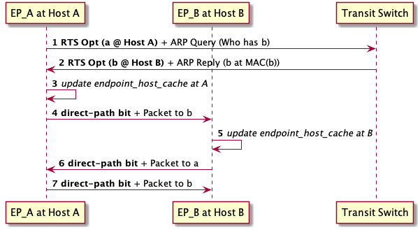
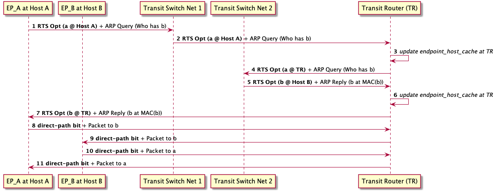
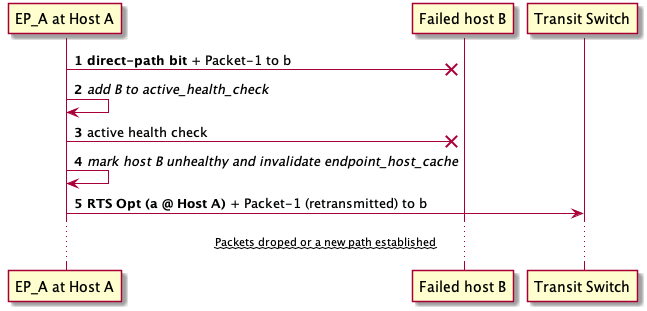

# Direct Path

The direct path feature allows a flexible data-plane fast path that avoids
multiple hops of flows through bouncers. Endpoints shall be able to communicate
directly between their hosting nodes without the need to go through bouncers or
dividers.

Bouncers will primarily serve the very first packet between two endpoints. As
most of these first packets are ARP requests and the bouncers respond to ARPs on
behlaf of endpoints, in practice _all_ packets within the same network will be
direct between the endpoints.

The direct path approach tightens the delay bound (due to multiple hops) to its
minimum. Additionally, by shifting traffic of most of the packets from the
bouncer, direct path will have the effect of reducing the number of bouncers
needed. Since scaling decisions will be primarly tken on new packets between new
endpoints, the number of scale-out decisions as well shall be minimized (unlike
making scale-out decisions based on all packets in a network).

## Overlay Packet Metadata and Endpoint Host LRU Table

To support the direct path feature, the transit agent may add a Return To Sender
(RTS) option to the outer packet header. The option carries information about
the endpoint's host IP and MAC addresses.

### RTS TLV and Transit Agent Behavior

The following list specifies the RTS option.

#### RTS Option * **Critical bit**: Unset * **Type**: 0x48 *
**Length**: 8 (4-bytes multiple), IPv4 and MAC addresses of the source
  endpoint's host.

The transit agent may add the RTS option if it is sending the outer packet to a
host other than the destination endpoint's host. If the transit agent is sending
the packet directly to destination endpoint's host, it only toggles one bit -
__direct-path bit__ - in the outer packet's fixed option. The direct-path bit is
set to indicate that the packet is already in direct path mode, which minimizes
the bandwidth overhead of the outer header options. The bouncer may also add the
RTS option if it is replying to an ARP request as it maintains the configuration
of all endpoint's hosts in the network.

### Endpoint Host LRU Table

Each transit XDP program (on each host) defines an LRU table
(endpoints_host_cache) of endpoints. The keys and values of the LRU table are
similar to the existing endpoints map (endpoint_key_t and remote_endpoint_t). An
entry in the table also carries a timestamp indicating when the entry was lately
updated.

### Ingress Packets

When parsing an ingress packet, the transit XDP program examines if the outer
header contains an RTS option, or if the direct-path bit is set. The host
information in the RTS option determines the source endpoint's host. In case the
direct-path bit is set the source IP address of the outer packet (and the MAC
address) are already those of the source endpoint's host. In both cases - RTS
option or direct-path bit are present - the program updates the endpoint's host
information in the LRU table and refresh the timestamp of the value of packet
arrival.

### Egress Packets

When a packet egresses from an endpoint, the transit agent first looks up the
endpoint_host_cache to determine if the destination host is known to the
program. If an entry found in the endpoint_host_cache , the program rewrites the
destination IP of the outer header to send the packet directly to the
destination host and sets the direct-path bit. Otherwise, the transit agent
sends the packet to the transit switch. In the direct-path case, the packet
bypasses all hops to the bouncers and dividers. This approach allows the flow's
packets to continue being sent directly between hosts.

The following diagram illustrates the __intra-network__ packet flow with the
direct-path.

### Divider Behavior

As the divider will be evaluating network access control (ACL), it is important
that all inter-network and inter-VPC packets remain being processed by the
dividers for the ACLs to take effect. The direct-path will still have an effect
of bypassing the transit switches in such traffic scenarios. Thus,
inter-networks packets will only exhibit a __normal__ extra-hop and the bouncer
hop will still be avoided.

To do so, a divider always before bouncing the packet for transimission it
replaces an RTS option, if present, with its own IP address. Note that the
divider while still caching the source enpoint's host normally for all ingress
packets. This simple behavior achieves the goal of bypassing the bouncers
(excess hop) and still evaluate inter-network ACLs when needed.

The following diagram illustrates the __inter-network__ packet flow with the
direct-path.

## LRU map Invalidation

An LRU map naturally evicts the endpoint entries for least used endpoints.
However, in some scenarios, a feedback loop to invalidate the LRU entries is
needed. Fortentutly, this feedback loop __does not__ require **out of band
signaling**. We use the exact same options to effectively invalidate the
endpoints_host_cache.

#### Case of Migrating or Deleting an Endpoint

When a packet with the direct-path bit set ingresses a transit XDP program of a
destination endpoint's host, the transit XDP program validates the destination
endpoint is on the host. If not, as in the case the destination endpoint
migrated or deleted, The transit XDP program bounces the packet back to the
sender and sets the RTS's option critical bit. This indicates to the sending XDP
program that the destination endpoint's is not anymore running on that host and
that the endpoints_host_cache is outdated.

When an XDP program receives an RTS option with the critical bit set, it simply
removes the corresponding entry from the endpoints_host_cache and continue to
process the packet normall by sending it back to the bouncer in a normal path.
If the endpoint was migrated, the new host information gets updated on the first
reply packet and direct-path continue normally. If the endpoint is deleted, the
bouncer drops the packet.

The following diagram illustrates the packet flow with the direct-path in case
of an endpoint migration/deletion.

### Case of Endpoint's Host Failure

Mizar also invalidates endpoint_host_cache in case of host failure. This is
needed because in such scenario, it is ambiguous if the endpoint has been
deleted, migrated to another host, or simply impaired. Mizar uses a hyprid
passive/active health check mechansims to determine the host's health status and
the direct-path feature also plays a role in health checking. When a packet
arrives from a host, the transit XDP program updates the timestamp of its
corresponding endpoint_host_cache entry. When the transit agent looks up an
entry for direct-path sending, it examines the timestamp of the entry. If the
entry has not been updated for a HEALTH_TIMEOUT seconds (configurable), it
places the host into an active_health_check ebpf array map. The transit daemon
continously monitors the entries of the active_health_check array map. If the
transit damon health checking thread, finds a host in the active_health_check it
actively sends health check messages. If no response received, the transit
daemon marks the host as unhealthy. If a transit agent finds a host marked
unhealthy, if skips the direct-path steps, and remove the corresponding
endpoing_host_entry for that host, while sending the packets normally through
the bouncer.

The following diagram illustrates the packet flow with the direct-path in case
of an endpoint's host failure.

### Security Group and Monitoring Consideration

Since we will allow packets to be sent directly to hosts, security group and
monitoring must be on the host. The bouncers/dividers will NOT implement such
functions. Network Access Control will remain evaluated on the dividers.

Note: The current version only supports the basic direct-path case. Handling of
endpoint migration and host failure is planned for future releases.
