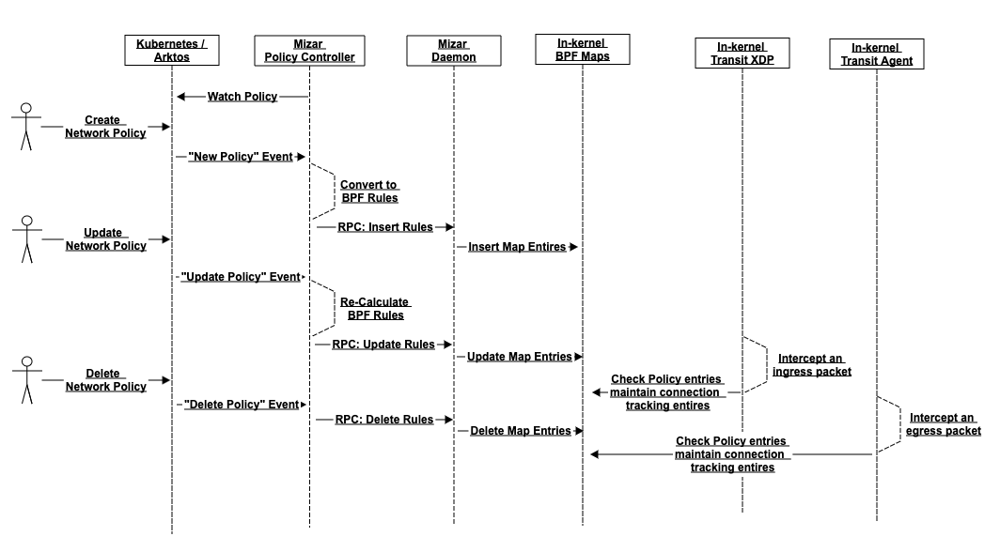

<!--
SPDX-License-Identifier: MIT
Copyright (c) 2022 The Authors.

Authors: The Mizar Team

Permission is hereby granted, free of charge, to any person obtaining a copy
of this software and associated documentation files (the "Software"), to deal
in the Software without restriction, including without limitation the rights
to use, copy, modify, merge, publish, distribute, sublicense, and/or sell
copies of the Software, and to permit persons to whom the Software is
furnished to do so, subject to the following conditions:The above copyright
notice and this permission notice shall be included in all copies or
substantial portions of the Software.THE SOFTWARE IS PROVIDED "AS IS",
WITHOUT WARRANTY OF ANY KIND, EXPRESS OR IMPLIED, INCLUDING BUT NOT LIMITED
TO THE WARRANTIES OF MERCHANTABILITY, FITNESS FOR A PARTICULAR PURPOSE AND
NONINFRINGEMENT. IN NO EVENT SHALL THE AUTHORS OR COPYRIGHT HOLDERS BE LIABLE
FOR ANY CLAIM, DAMAGES OR OTHER LIABILITY, WHETHER IN AN ACTION OF CONTRACT,
TORT OR OTHERWISE, ARISING FROM, OUT OF OR IN CONNECTION WITH THE SOFTWARE OR
THE USE OR OTHER DEALINGS IN THE SOFTWARE.
-->  

# Enforcing Kubernetes Network Policy in Mizar


This document describes the design of enforcing Kubernetes network policy in Mizar, including the requirements, architecture, component changes and design considerations.

## Requirements
* Support standard [network policy object spec] (https://kubernetes.io/docs/reference/generated/kubernetes-api/v1.19/#networkpolicy-v1-networking-k8s-io) in Kubernetes. 
* Track connection states. Once a connection is established on one direction (ingress or egress), the reply packets are automatically allowed on the other direction.
* Support up to 64 policies per endpoint. No limit for the number of total policies in a namespace.
* Efficient policy check on packets. Ideally O(1) time.
* Non-scope:
	* Anti-DDOS.
	* Kubernetes Ingress/egress bandwidth limit.
 
## Architecture and workflow

Below is the overall architecture of the network policy support in Mizar: 


<p style="text-align: center;"> Figure 1 The overall architecture </p>


Below is a sequence diagram to show the workflow when a network policy object gets created, updated or deleted. It shows how the components in above architecture diagram work together:


<p style="text-align: center;"> Figure 2 Workflows for CRUD of network policy objects </p>

The changes of other objects, like pods and namespaces, could also trigger the CRUD flow of network policy rules. 

In the kernel, some extra XDP functions are added in Mizar transit XDP and transit agent respectively to enforce policies: 

* For ingress traffic, packets are inspected in transit XDP, which is the earliest point that we can inspect and drop a packet.
* For egress traffic, packets are inspected in the XDP hook of veth dev in the host namespace. It's part of the transit agent. Note: for security reasons, we shouldn't attache egress hooks inside the pod network namespace. Therefore transit agent is the earliest point that we can inspect egress traffic.


## Key Implementation

### 1. O(1) Policy Check

Policy check happens to every packet during run time. It's critical to make sure the check is as efficient as possible. One packet may involve many different policies. It would be time-consuming if it iterates each policy one by one (in other words, with O(n) time complexity).  

Mizar uses an approach based on bitwise operation to ensure O(1) time for enforcing every ingress and egress packet, and also to ensure it supports up to 64 policies per endpoint. It's guaranteed the operation is in constant time no matter how many policies are related to this packet.

The solution is built on the following ideas:

* Every policy has an ID represented by a unique bit, for example 0x00000001, 0x00000010, 0x00000100, etc.
* Use different maps to store allowed IP blocks, except IPs or IP blocks, and ports.
* In each map, the value part is an uint64 which represents all policies that applies to this rule. For example, if both policy #1 and #2 allows IP block 192.168.0.0/16, the entry will be like this: <vni, local_ip, 192.168.0.0/16> --> 0x00000011
* Use bitwise operation among the values from above maps to see if the final operation result is great than zero. If true, it means there is at least one policy meets all requirements.
* Lastly, to not limit the total number of policies, policy ID are encoded per endpoint. So this design supports up to 64 policies for a single endpoint. And there is no limit for total number of policies.

The implementation also replies on BPF map type BPF_LPM_TRIE to efficiently lookup matched CIDR blocks for an individual IP.

#### 1.1 Map Schema

Here we are using the BPF maps for ingress policy check as an example. The same-schema maps are defined for egress policies, only with a different map name.


* ing\_vsip\_enforce\_map: indicates if an endpoint is enforced by any network policy

Field | Example
------------ | -------------
Key = { VNI,  local IP } | { 0x01, 10.0.0.2 }
Value = boolean | 1 - need to enforce; 0 - not to enforce (default)

 
* ing\_vsip\_prim\_map: source IP range table (primary)

Field | Example
------------ | -------------
Key = { VNI, dest ip, source cidr } | { 0x01, 10.0.0.2, 10.1.1.0/24 }
Value = bitmap of relevant policies | 0x0101
 
* ing\_vsip\_prim\_map: source IP range table (supplementary with except entries)

Field | Example
------------ | -------------
Key = { VNI, dest ip, source cidr } | { 0x01, 10.0.0.2, 10.1.1.0/24 }
Value = bitmap of relevant policies | 0x0111

* vsip\_ing\_except\_map: except table

Field | Example
------------ | -------------
Key = { VNI, dest IP, except-cidr } | { 0x01, 10.0.0.2, 10.11.1.128/25 }
Value: bitmap of except policies | 0x1010
 
* ing\_vsip\_ppo\_map: Proto-port table

Field | Example
------------ | -------------
Key = { VNI, dest ip, proto, port } | { 0x01, 10.0.0.2, tcp, 3678 } // L4 egress { 0x01, 10.0.0.2, 0, 0 }  //L3 egress
Value = bitmap of relevant policies | 0x0011 (indexing is src-IP specific)

#### 1.2 Algorithm
 
 Below is the algorithm to check an incoming packet to see if there is any policy allows it. The same algorithm applies to both ingress enforcement and egress enforcement. 

```C
int enforce_policy_on_packet(packet) {

   If {packet.VNI, packet.source IP} is not in ing\_vsip\_enforce\_map {
     return XDP_PASS
   }
   
   if connection_tracking_is_reply(packet) {
     return XDP_PASS
   }

   dip_prim_rule = Dest-IP-range-primary-table[packet.VNI, packet.source-ip, packet.dest-ip];
   dip_supp_rules = Dest-IP-range-supplementary-table[packet.VNI, packet.source-ip, packet.dest-ip];
   dip_except_rules = dest-ip-range-excpet-table[packet.VNI, packet.source-ip, packet.dest-ip];
   pp_l4_rules = Proto-port[packet.VNI, packet.source-ip, packet.dest-port, packet.protocol];
   pp_l3_rules = Proto-port[packet.VNI, packet.source-ip, 0, 0 ];


   //perform the bit operation to the get final result, to see if there is any policy allows the packet
   result =  (dip_prim_rule | (dip_supp_rules & ~dip_except_rules)) & ( pp_l4_rules  | pp_l3_rules )
   If result != 0 {
	  return XDP_PASS
   } else {
	  return XDP_DROP
   }
}
```


### 2. Connection Tracking

#### 2.1 Basic functionality

Connection Tracking is a map that records all active TCP/UDP/SCTP connections. When a connection is established on one direction (either ingress or egress), it's saved into the connection tracking map and then the packets on the other direction will be regarded as reply packets and automatically allowed.

Note: UDP protocol doesn't have a connection concept. Here we are referring to a logic connection identified by a 5-tuple (local IP, local port, remote IP, remote port, UDP).

Below is how connection tracking entires are maintained and checked when inspecting a packet. The same algorithm applies to both ingress traffic and egress traffic:
 

```C
int enforce_policy_on_packet(packet) {
   if (packet.potocol != UDP|TCP|SCTP) {
      return XDP_PASS
   }
   
   if connection_tracking_is_reply(packet) {
      return XDP_PASS 
   }

   if enforced_by_policy && policy_check_result == false {
       update_connection_tracking_state(packet, denied)
       return XDP_DROP
   }

    //now we will return pass
    update_connection_tracking_state(packet, allowed)
   
    return XDP_PASS
}
```

#### 2.2 Invalidating entries (TBD)

### 3. Label-based Enforcement(TBD)

## Component Changes

### NetworkPolicy Controller

* A new controller, NetworkPolicy controller, will be introduced in this design to watch network policy object CRUD events. 
* This controller converts the policy objects to low-level BPF map rules, and call daemon to update the rules.

### Pod Controller

* When a pod gets created, updated or deleted, it will check whether the pod is related to existing network policies. 
* Trigger the policy rule CRUD process if the pod involves network policies.


### Mizar Daemon

* New RPC interfaces are implemented to receive the network policy CRUD messages from Mizar master, and then updates the corresponding BPF maps in the kernel space. 
* Delete invalid entries in connection tracking based on the updated policies.


### Transit XDP

* Call connection tracking module to check if the packet is a reply packet. 
* Perform policy check on ingress packets. 
* Call connection tracking module to update connection tracking if a new connection is establish.

### Transit Agent

* Call the connection tracking module to check if the packet is a reply packet. 
* Perform policy check on egress packets. 
* Call connection tracking module to update connection tracking if a new connection is establish.

### Connection Tracking

* Maintain connection states.

| Status | Description |
| ------ | ----------- |
| 0x01   | traffic is denied or allowed |
| 0x04   | need to re-evaluate applicable policy, or simply base on decision already made |

When traffic is denied by policy enforcement, its tracked connection will have state 0x01 (for tcp), or 0x05 (udp); when allowed, state is 0x00(tcp) or 0x04(udp), respectively.

When xdp prog is making decision for the reply flow, for packets that are reply of a tracked connection, it will re-evaluate with the policy of the originated direction - if the state indicates so (which applies to udp flows).

* Map entries, when they are not allowed by updated policies, are still tracked in the map and their state changed to denied to reflect the policy. The aging of such entries would be handled by the LRU map automatically.
* Remove map entries when the associated endpoint is deleted.


## Design Considerations

* Both ingress check and egress check are performed at XDP layer instead of TC layer for the best performance. For egress check, it's possible to hook it at the TC in container network namespace if security privilege is not a concern. For now for safety reason we only hook it in host network namespace.
* According to Kubernetes network policy specification, only TCP/UDP/SCTP packets are enforced. Other packets, like ICMP packets, will always be allowed.
* 64 policies per endpoint is not a hard limit of the design. By extending the length of value in policy maps we can easily support 128, 256 or even more. It's just a trade-off between supported policies number and memory consumption. We choose 64 only because it's large enough for a single endpoint.
* When Mizar daemon update policy map rules during a policy update, it will first delete entries and then insert new entries, and the "except" map entries will be deleted after new entries are added. With this way we ensure no packets will be mistakenly allowed during the intermediate state. 
 

