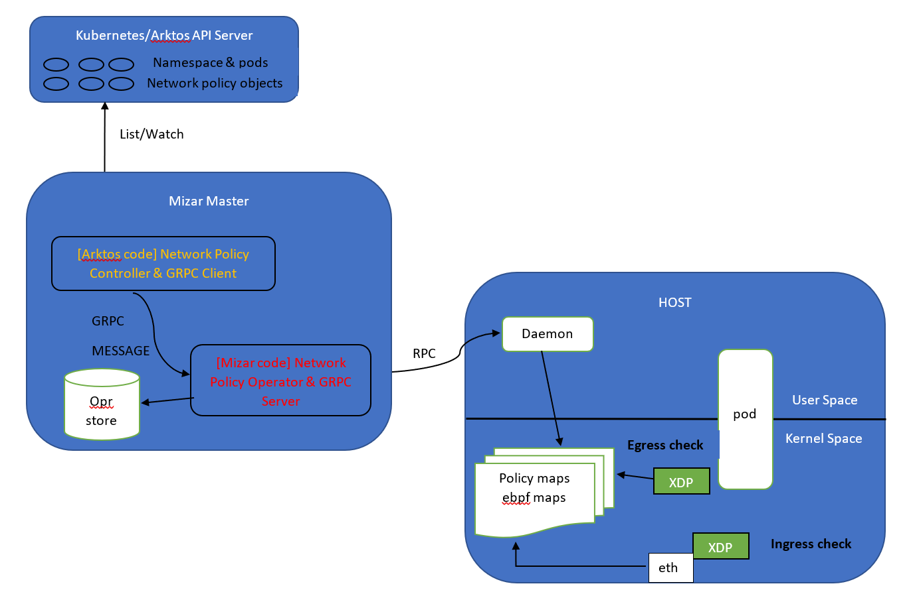

# Enforcing Kubernetes Network Policy in an Arktos-Mizar Integrated Environment


This document describes the design of enforcing Kubernetes network policy in Arktos-Mizar integrated environment, including the requirements, architecture, component changes and design considerations.

## Requirements
* Support standard [network policy object spec] (https://kubernetes.io/docs/reference/generated/kubernetes-api/v1.19/#networkpolicy-v1-networking-k8s-io) in Arktos

## Architecture

Below is the overall architecture of the network policy support in Arktos and Mizar: 



<p style="text-align: center;"> Figure 1 The overall architecture </p>

## Workflow

With our current design, network policy controller (in yellow) only watches network policy object events, and it is depended on ```mizar network policy operator (in red)``` to do the calculation and then update eBPF maps. For instance, when a network policy is created, ```network policy controller (in yellow)``` detects the event and lists network policy’s metadata, and then it composes network policy’s metadata into ```GRPC message``` and sends the message through ```GRPC client (on the arktos side)```. Then ```GRPC server (on the mizar side)``` receives the message and triggers network policy creation workflow which is operated by ```network policy operator (in red)```. Network policy operator then starts the calucation process described below. 

### Network Policy Create/Update Calculation

Update_and_retrieve_endpoint_names: 

1. Update operator store for label_networkpolicies_store[label] = network_policy which is stored in mizar operator store. Note that operator store is a in-memory storage system in mizar.
2.	Based on label vs network_policy dictionary in step 1, find all the pod’s names that satisfy label key-value set. NOTE: this step involves calling Kubernetes API server to get list of pods.
3.	From step 2, we got the list of pods that satisfy podSelector label, which are the pods that will be affected by the network policy creation/update. From the pod list, we then retrieve from mizar operator store to get list of endpoint objects associated with these pods. Note: each endpoint obj keeps track of a list of network policy associated with this endpoint. Later in the process, it needs update this list with affected network policy names. 
4.	Add all endpoints retrieved in step 3 and add them to a list (ep_names_to_be_handled), and then remove endpoints that was in networkpolicy_endpoints_ingress_store or networkpolicy_endpoints_egress_store (this is stored in mizar operator store) but no longer in ep_names_to_be_handled list. 

handle_networkpolicy_update_delete

1.	It gets the list of endpoints that are affected by the network policy update or create (step 4 above), and then mizar operator tries to retrieve all the endpoint objects (stored in mizar operator store) from the list. 
2.	In step 3 above, each affected endpoint obj keeps track of all the network policy associated with this endpoint obj. Thus, mizar operator can get a list of network policies that are associated with this endpoint object and calculate the bit map which will update ebpf map later. 

## Design Consideration and Challenges  

Previously, with kind cluster, mizar can call kubernete API server directly and access operator store at the same time. However, with arktos integration, mizar network policy operator (in red) cannot call arktos API server directly. 

* Previously, we have added mizar controllers (pod controller, node controller etc) into Arktos's code repository to watch and listen object events (such as pod creation and deletion). Once mizar controller detects an event (e.g. pod create), it then sends a gRPC message through gRPC client (in arktos). Then, the gRPC server(in mizar) receives this message and triggers this event in mizar (e.g. pod create). Please note that in mizar it is called "workflows" (e.g. pod creation workflow) where it is executed by "operator". After the workflow finishes, mizar then replies back a gRPC message with the execution results (e.g. replies back "OK" if workflow completes successfully). 

* As mentioned in section “network policy create/update”, network policy creation process needs access both mizar operator store and arktos API server. If we were to move the entire network policy calculation process (currently managed by network policy operator in red) into network policy controller (in yellow), we can now send request to arktos API server. However, by doing so, we then lost access to mizar operator store and stored endpoint object information. 

## Proposal

We can add couple dictionaries into mizar operator store to keep track of network policy related objects (network policy, pods, and namespaces): 
1. Key = node’s host ip & value = names of the pods on each node. 
2. Key = pod name & value = its labels 
3. Key = namespace name & value = its labels 

Basically, we are trying to avoid making arktos API server calls from network policy operator (in red). Since network policy operator can only access operator store (not arktos API server), we can keep a copy of pods and namespace information in operator store which is necessary for network policy calculation. 

## Key Implementation

### 1. Mizar Operator Store

Add three additional object store into Mizar operator store to track pods and namespaces: 
* node_pods_store: key = node's host ip address & value = names of the pods on each node
* pod_label_store: key = pod name & value = each pod's labels
* namespace_label_store: key = namespace name & value = each namespace's labels

Are we going to have race condition here??? How to avoid race condition

### 2. Add Network Policy Controller in Arktos Repo

* Watch network policy events such as create, update and delete
* Compose network policy's metadata information into GRPC message and send through GRPC client 

### 3. Add Namespace Controller in Arktos Repo (C2C)

* Watch namespace events such as create, update and delete
* Compose network policy's metadata information into GRPC message and send through GRPC client
```
BuiltinsNamespaceMessage{
        Name:          namespace.Name,
        Labels:        []string{},
        Phase:         string(pod.Status.Phase)
}
```
### 4. Add Label Information into GRPC messages for pods (C2C)
* List all labels' key/value sets into GRPC message for pod events
```
BuiltinsPodMessage{
	Name:          pod.Name,
	HostIp:        pod.Status.HostIP,
	Namespace:     pod.Namespace,
	Tenant:        pod.Tenant,
        Labels:        []string{},
	ArktosNetwork: network,
	Phase:         string(pod.Status.Phase)
}
```
### 5. Remove all kubenetes API Calls During Network Policy Calculation 
* Remove kubernetes API calls
* Replace with mizar operator store queries. 
