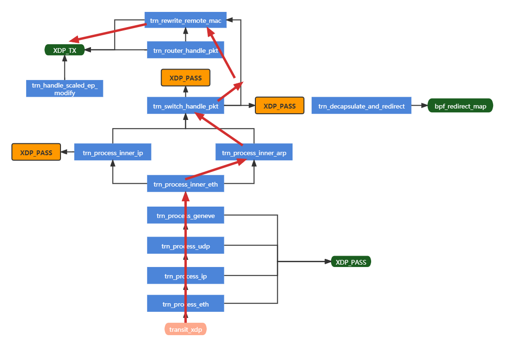

<!--
SPDX-License-Identifier: MIT
Copyright (c) 2021 The Authors.

Authors:
Peng Yang               (@yangpenger)      

-->

Considering the limitation of the SmartNIC (cannot redirect, and only supports HASH and ARRAY type map), bouncers and dividers (forwarding function) are offloaded to the NIC. 

The first packet between two endpoints will pass through the bouncer/divider. This forwarding function will be implemented on the NIC. On the contrary, for the XDP program on the endpoint host's kernel, every packet (not only the first) will pass through it. The main function is to redirect rather than forward, so it is not the offloaded target.

The offloaded workflow is as follows (The black line represents the logic of the mizar, and the red line represents the partial function offloaded to SmartNIC):

## constraints

1. SmartNIC only supports BPF_MAP_TYPE_ARRAY and BPF_MAP_TYPE_HASH; the sum of map entries on the NIC should be less than 3,072,000; a maximum limit of 64 bytes per entry (key + value).

   

2. The maximum number of program instructions on the SmartNIC is only 2800.

   

4. The NIC does not support redirect.