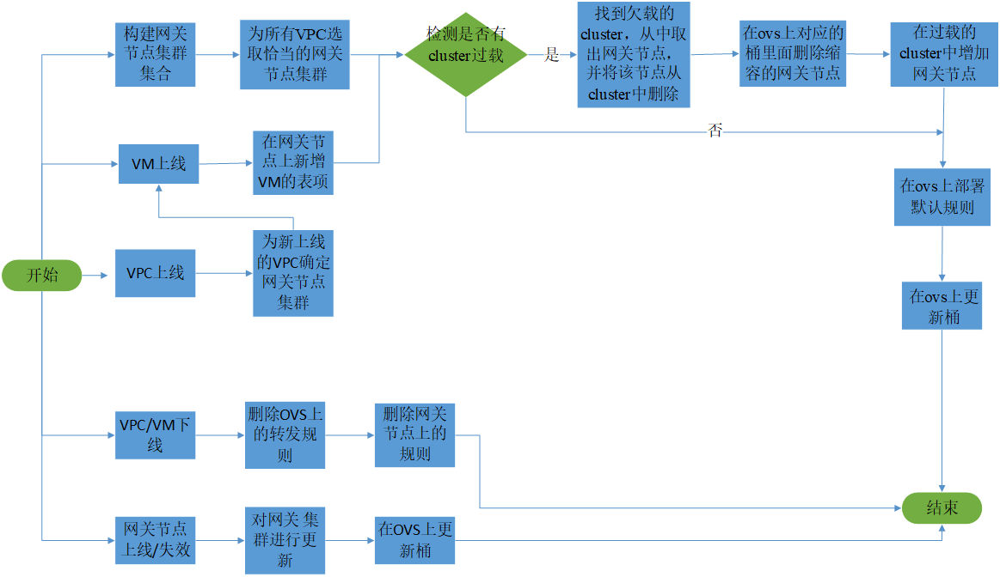

## 基于基础网关的表项按需下发技术

### 一、需求

在云网络中，每当VPC上线时，都需要在计算节点上下发流表。当VPC规模很大时，虚机上线的速度就会很慢。为提高虚机上线的速度，计算节点上表项按需下发需要满足：

- 在虚拟机上线时只部署少量必要流表，其余表项在虚拟机上线后逐步按需下发；

- 上线时下发的流表项大小与VPC规模解耦；

- 部署在宿主机上的表项数量大大减少，从而降低高密度服务器的过载和故障风险；

### 二、网关节点转发模型

  为减少虚机上线时下发的表项，提高虚机上线的速度，我们设计了网关节点转发模型。每个网关节点存储了一个VPC或多个VPC的全局表项信息。在网关节点转发模型中，当一个虚机上线时，表项配置主要分为两个部分：

- 下发虚机相关配置，使之接入网络，同时在主机侧ovs上配置桶到网关节点的映射（桶在下文介绍）。此时虚机已经上线成功。

- 当新上线虚机需要与其他虚机进行通信，首先查询主机侧OVS表项，由于新上线表项中仅存在到达网关节点的表项，故将该流首包上传至网关节点，由网关节点查询全局表项并下发相应表项至主机侧ovs。此后，对于已经下发过表项的虚机对之间可以进行direct path转发。

Figure 1. 网关模型

### 三、网关节点集群管理

将网络中所有的网关节点划分为若干个网关节点集群，集群内网关节点identical，集群间网关节点可以异构。同一个VPC的流量仅被分配到一个网关节点集群，同一个网关集群管理的VPC数量有限，从而提高网络的健壮性。
网关节点集群管理主要功能包括：网关节点集群的初始化 、确定VPC到桶（网关节点集群）的映射和网关节点集群的更新。

### 3.1 网关节点集群的初始化
在系统开始运行时，根据网络状况（比如网关节点数量、计算节点数量、VPC预估数量等）将网关节点划分为若干网关节点集群，最简单的方案为均分。
### 3.2 为每个VPC选取对应的桶
为了从源节点实现网关节点集群的负载均衡，在每个计算节点侧的OVS设计一个桶的结构。每个计算节点上桶的数量为网关节点集群的数量，与网关节点集群一一对应，不做动态调整。桶可以使用Round Robin算法把数据包发送给该桶对应网关节点集群中的某一个网关节点。我们以VPC_id的粒度将流映射到不同的桶。我们可以使用流表将流转发至某个桶（组表项），然后用组表项实现网关节点集群间的负载均衡。具体方案见“桶的具体实现思路”章节。
流到桶（网关节点集群）的映射确保以下原则：
- 所属同一个VPC的流量被映射到一个网关节点集群，从而保证该VPC流量发生异常时，只影响对应的网关节点集群，即对其他VPC的影响尽量小。
- 每个网关节点集群管理若干个VPC，从而确保集群发生异常时，所受影响的VPC数量尽量少。此外可以确保每个网关节点上保存的表项信息尽量少（管理哪些VPC就保存哪些VPC的表项信息）；
- 每个网关节点所转发的流量不能超过网关节点的能力限制。后续若由于某个VPC扩容或者流量增多导致对应的网关节点集群过载，则需要对网关节点集群进行扩容，即进行桶与网关节点映射的更新，确保网关节点不过载。

### 3.3 网关节点集群的更新（更新发生是小概率事件，不经常出现）
网关节点集群内网关节点的更新由以下事件触发：
- 某个网关节点集群过载，则需要对该网关节点集群进行扩容，具体方法是在桶到该网关节点集群映射的round robin算法中增加新的网关节点。
- 某个网关节点失效，则需要将该网关节点从所属网关节点集群删除，即从桶到网关节点集群映射的round robin算法中删除。
- 某个网关节点新增，则根据现网状态，将该网关节点加入至负载较大的网关节点集群，同时在桶到该网关节点集群映射的round robin算法中增加新的网关节点。
需要注意的是，在网关节点集群更新时，我们只更新对应VPC所在计算节点上的组表项（桶），而并不是更新全部计算节点侧的组表项。

Figure 2. 网关集群管理流程

## 四、桶的具体实现思路
可以利用组表项来实现桶的功能。具体来说，我们将每条组表项看做是一个桶，组表项中的action buckets保存相应网关节点集群中所有网关节点对应的出端口，即每个桶对应一个网关节点集群，每个计算节点上桶的数量与网关节点集群的数量一致。此外，我们利用流表项实现VM到桶的映射。

Figure 3. 使用组表实现桶

我们用一个例子来说明，如图二所示，VMX属于VPC1、VMA属于VPC2, VPC1和VPC2的流被我们安排至网关节点集群1，网关节点集群1包含两个网关节点gateway1和gateway2。计算结点1的gw_port1、gw_port2端口分别与网关节点gateway1、gateway2相连。那么我们在计算结点1上部署一条组表项，组标识符为4，action buckets为：bucket1:output=gw_port1；bucket2:output= gw_port2。此外，通过部署低优先级流表项，将未匹配到高优先级流表项（vm-vm直接路径转发表项）的所述VPC1的流导至组表项4，从而计算节点1上所有VPC1的流均会被导至组表项4，通过组表项4被任意转发至网关节点gateway1或gateway2。通过流表+组表，可以实现vpc到网关节点集群的映射。

## 五、接口设计
网关结点分为三个模块，一个是控制模块，一个是转发模块，一个gateway_DB模块。
- 控制模块主要负责与管理平面以及主机侧OVS通信。包括接收管理平面对网关节点流表的增删改操作的指令；封装相应流表安装消息下发给主机侧OVS实现主机侧OVS流表的下发。
- 转发模块主要负责首包的转发。
- Gateway_DB模块负责存储该网关节点所属集群所管理的VPC的全局表项信息。

Figure 4. 模块设计

### 5.1 control与management plane的接口
管理平面可通过RPC调用访问网关结点提供的接口。主要功能是通过管理平面实现对网关节点中全局表项的管理（流表增删改操作）。
- gw_update_endpoint(ep_key, ep_msg)
**功能：**
维护全局表项。当endpoint上线或迁移时，在网关结点的gateway_DB中增加或更新有关endpoint的流表信息。
**参数：**
ep_key: 唯一标识一个endpoint。
ep_msg: endpoint的信息（如VIP、 node、network、VNI等）。

- gw_delete_vpc（vpc_key）
**功能：**
在网关结点的gateway_DB中删除指定VPC及属于此VPC的子网的所有endpoint的流表信息。
**参数：**
vpc_key: 唯一标识一个vpc。

- gw_add_vpc（vpc_key）
**功能：**
在网关结点的gateway_DB中增加指定VPC及属于此VPC的子网的所有endpoint的流表信息。
**参数：**
vpc_key: 唯一标识一个vpc。

- gw_delete_network(net_key)
**功能：**
在网关结点的gateway_DB中删除指定network及属于此network的所有endpoint的流表信息。
**参数：**
net_key:唯一标识一个network

- gw_delete_endpoint(ep_key)
**功能：**
在网关结点的gateway_DB中删除指定endpoint的流表信息。
**参数：**
ep_key:唯一标识一个endpoint。

### 5.2 control与forward的接口
- of_parse(packet)
**功能：**
当有包到达网关结点转发层，对数据包进行解析，提取出关键字信息(如源IP、源mac、目的IP、目的mac等)封装后交给控制层。
**参数：**
packet：转发层收到的数据包。
**返回值：**
of_match:控制层可以识别的数据包关键字信息。

- of_lookup(of_match, table)
**功能：**
根据关键字信息由控制层在gateway_DB中搜索相应转发规则。
**参数：**
of_match: 从转发层数据包中提取的关键字信息(如源IP、源mac、目的IP等)
table: 网关结点保存的全局流表信息。
**返回值：**
rule: 搜索到的匹配规则。

### 5.3  control与OVS的接口
- of_flow_mod(dp, rule)
**功能：**
用于在指定OVS上安装一条流表
**参数：**
dp: 唯一标识一个OVS
rule: 流表规则

- of_del_flow(dp, rule)
**功能：**
在OVS上删除一组规则。
**参数：**
dp:OVS的唯一标识符
rule: 流表规则

- of_update_flow(dp, rule)
**功能：**
在OVS上更新一组规则。
**参数：**
dp: OVS的唯一标识符。
rule: 流表规则。
	
- ovsdb_conf(dp, ovsdb_msg)
**功能：**
用于配置指定的OVS交换机(如建立OVS之间的隧道)。
**参数：**
dp: 唯一标识一个OVS
ovsdb_msg：配置信息

- ovsdb_del_conf(dp, ovsdb_msg)
**功能：**
用于删除指定的OVS交换机的相应配置(如删除OVS之间的隧道)。
**参数：**
dp: 唯一标识一个OVS
ovsdb_msg：要删除的配置信息

- of_creat_default_rule(dp, rule)
**功能：**
用于在指定的ovs交换机上当一个新虚机上线时，需要为其安装默认规则。
**参数：**
dp: 唯一标识一个OVS
rule：流表规则

- of_update_bucket(dp, group_rule)
**功能：**
用于在虚机上线或者网关节点集群扩缩容时在指定ovs交换机上创建或者更新桶（组表项）。
**参数：**
dp: 唯一标识一个OVS
group_rule：组表规则
**实现思路：**
当网关节点集群扩缩容时，该集群对应的VPC所在的计算节点侧，更新桶（组表），将扩缩容的网关节点从桶中删除或增加。
当虚机上线时，若该虚机所处计算节点没有该VPC对应的桶，则在该计算节点侧ovs增加桶（组表项），将该vm的流导至对应网关节点集群。

5.4 Management Plane中网关节点集群管理的关键函数：
- create_cluster_set(gw_total_set)
**功能：**
将初始的网管节点集合划分为多个网关节点集群。
**参数：**
gw_total_set：初始网关节点集合

- update_cluster_set(gw_key)
**功能：**
对网关节点进行更新。
**参数：**
gw_key：唯一表示一个网关节点

- create_cluster (gw_set)
**功能：**
新增网关节点集群。
**参数：**
gw_set：网关节点集合

- del_cluster (cluster_key)
**功能：**
删除网关节点集群。
**参数：**
cluster_key：唯一表示一个网关节点集群

- detect_overload_cluster (cluster_set)
**功能：**
检测网关节点集群集合中是否有过载的集群。
**参数：**
cluster_set：网关节点集群集合
**实现思路：**
检查每个集群所管理的vm的数量，如果每个网关节点平均管理的vm数量大于阈值，则定为过载。

- detect_underload_cluster (cluster_set)
**功能：**
检测网关节点集群集合中是否有欠载的集群。 
**参数：**
cluster_key：唯一表示一个网关节点集群
**实现思路：**
检查每个集群所管理的vm的数量，如果每个网关节点平均管理的vm数量小于阈值，则定为欠载。

- detect_failed_gw (gw_set)
**功能：**
检测网关节点集合中是否有失效的节点。
**参数：**
gw_set：网关节点集合

- is_cluster_empty (cluster_key)
**功能：**
检测网关节点集群管理的VPC是否为空。
**参数：**
cluster_key：唯一表示一个网关节点集群

- vpc_set_map_to_cluster (vpc_set, cluster_set)
**功能：**
在系统开始运行时，为每个vpc确定恰当的网关节点集群。 
**参数：**
vpc_set：vpc集合
cluster_set：网关节点集群集合

- vpc_map_to_cluster (vpc_key, cluster_set)
**功能：**
当一个vpc新上线时，为这个vpc确定恰当的网关节点集群。 
**参数：**
vpc_key：唯一标识一个vpc
cluster_set：网关节点集群集合
**实现思路：**
当一个新的VPC上线时，选择一个剩余处理能力最多的网关结点集群。

- add_gw_to_cluster (gw, cluster_key)
**功能：**
在网关节点集群cluster中新增一个网关节点。
**参数：**
gw：网关节点
cluster_key：唯一表示一个网关节点集群

- del_gw_from_cluster (gw, cluster_key)
**功能：**
在网关节点集群cluster中删除一个网关节点。
**参数：**
gw：网关节点
cluster_key：唯一表示一个网关节点集群
