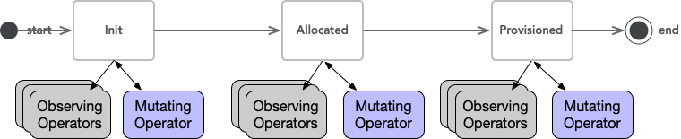

# Mizar Management Plane

Mizar's management plane is based on refactoring the test controller
we have in Mizar into Kubernetes based operators. The test controller
allowed us to design the initial workflows functionality, which we
extend it here into a fully distributed, elasticaly scaling, and
kubernetes-native design. Several existing components allows this
design to happen, which we reuse:

1. **Kubernetes Custom Resouce Definition:** Allows us to extend the K8s
   API server with networking objects. Some of these objects are
   generic to any networking solutions and some of them are specific
   to Mizar.
2. **Kubernetes Operator Framework:** [Operators
   Pattern](https://kubernetes.io/docs/concepts/extend-kubernetes/operator/)
   helps extending Kubernetes with domain-specific operators that
   client APIs that _act as a controller_ for CRDs. Operator
   frameworks allow us to write custom lightweight operators the
   derive the networking objects life-cycle. We particulary use
   [Kopf](https://github.com/zalando-incubator/kopf) extensively as it allows us to easily refactor the test controller.
3. **LMDB**: Provides a light-weight in-memory transactional database
   that is __local__ to each Operator.

## Object-Pipeline Architecture

The following diagram illustrates the overall architecture of the
management plane. The main components of this architectures are
objects and operators.

Objects are any networking object, that the
management plane derives their life-cycle. When it's first created an
object becomes in Init state. Multiple operators work together - in
a distributed way - to evolve an object state to a Provisioned state.
Between the Init and the Provisioned state, an Operator may transition
the object's state to other intermediate states that are specific to
the data-plane requirements. Once the object is Provisioned it implies
that the data-plane is ready to function given that object symantics.

We refer to this process as the Object-pipeline, which is illustrated
in the following diagram of a Generic Object Pipeline. We will explain
several example of the application of this approach to develop Mizar's
workflows.

Operators program the data-plane through direct RPC interfaces exposed
by Transid (a daemon-set running in each worker host). These RPC
interface allows the management plane to follow the well-known design
pattern of having less number of management-plane clients call large
number of servers to prevent failures to cascade between components.
Also having "One" daemon-set exposes multiple extensible RPC
interfaces minimizes the number of agents on the hosts, improves
deployment story, and reduces the chances of cycle-stealing from
actual workload on the host.

We split Objects and Operators into two main categories: Generic, and
DataPlane specific. The Generic objects are necessary for any
cloud-networking solutions such as: VPC (or Network in Neutron
terminology), Network (or Subnet in Neutron), Endpoint (or Port in
Neutron), And Droplet which specifies a host (Or a Worker node in
Kubernetes). The other category of objects are those that are
data-plane specific; For Mizar these are Bouncers and Dividers
Objects.  Each Object's must specify a "status" field that indicates
the status of the object in the pipeline. Two statuses are necessary:
Init, and Provisioned. In the PoC, the Management plane has four
generic objects: Droplet, VPC, Network, and Endpoint. Each Object is
specified using Custom Resource Definitions (CRDs).

Each Operator is responsible for maintaining the data of one and only
one object (Stateful Object). We call this a Stateful Object from the
operator perspective, since the Operator maintains its data. It is
mandatory that an Operator updates the data for its Object when it is
in the Provisioned state and optional in any other state. Operators
may also mutate the state of objects other than its Stateful Object,
but never store these objects data. We call these Objects Mutable
objects from an Operator perspective. The Objects types with respects
to Operators will become clear as we detail Mizar's workflow.

The specification of an Operator's Stateful Object, Mutable Object,
and Mutating Actions are what defines the management plane workflow.

### Inter-Operators Communications

Operators communicate with each other to evolve the object's state.
When an operator mutates the state of the object it invokes the next
operator(s) in the object pipeline. The invocation is done through a
callback mechanism. According to the deployment and specific
implementation the callback is translated into one of multiple modes.
In all of these modes, the operator developer only focuses on the
workflow through calling the callback function without worrying about
the details of the communication implementation.

1. **Through the API Server(s)**: In this mode, operators communication is
   implicit with the help of the API server. As one operator makes the
   callback to invoke the next step of the object pipeline, the
   only changes the object state and update the object rhough the API
   server. As the next Operator in the pipeline handles the object in
   the new state, communication happens implicitly. The drawback of
   this approach is the loading on the API server, the latency
   involved to evolve the object's pipeline. The advantage is that the
   object state is always tracked through the system.
1. **Direct Service Communication**: In this mode, operators exposes a
   service interface through RPC or any other mechanism, and the
   callback effectively calls the RPC on the other operator. The
   calling operators must handle failure scenarios in such case. The
   drawback of this approach is the complexity of handling failure
   scenarios. Also, as the intermediate states of the objects are not
   updates to the API server, it becomes harder to troubleshoot
   problems in the object-pipeline. This approach __may__ have latency
   advantage, especially if the API server communication is a
   bottlneck. However, if the API server and kubernetes storage scales
   horizontally latency of the this approach and the second approach
   may be comparable. In that case, this approac only adds
   implementation complexitie that are hard to diagnose.
1. **Simple Function Calls**: In this mode, all operators are deployed
   into a single (horizontally scalable) operator. The functional
   implementation of the operators is still seperated through
   call-back interfaces. But the callbacks are implemented as simply
   function calls. This approach is the simplist to develop, test, and
   diagnose. It also minimizes the latency since there is no network
   communication between the operators. Only the initial and final
   state of the objects must be updated through the API server. All
   other intermediate states are hidden. The drawback of this approach
   though is that local object store of the operator may have a huge
   size. The other drawback is similar to the second mode where  the
   intermediate states of the objects are not avaiable to the API
   server; hence, it is harder to troubleshoot and track the object
   state for problem diagnosis.

The drawback of the third approach are of a less impact on the
development, performance, and operation. Not to mention simplicity.
First, we can solve the local object store size problems by means of
sharding through an operator proxy layer (which is a typical design
pattern). The proxy layer shards the objects across replicas of the
operator hence both reduce overload and local object store size.
Second, the other drawback of tracking the object state for
troubleshooting becomes less of a concern in the simple function calls
mode because state transitions is within the same process with unified
logging, and metering.

### Local object store (LMDB) and Resumable Workflow

Each Operator will have a local K/V store implemented with
[LMDB](https://symas.com/lmdb/). Each Operator stores its Stateful
Object in this store when it reaches the state "Provisioned" and
delete it when the object is recycled (deleted). The objects are
stored in their Provisioned state, there is no need to develop a
complicated cache synchronization mechanism as the object is
cached into an final (immutable) state.

Given the operator being a StatefulSet, the store persists in the
volume. When the operator is replaced it resumes the workflow by
serving stalled objects in the API server (in Init or recorded
intermediate state) utilizing the data of the provisioned objects in
the local store. In this regard, the local store serves two purposes:

1. It caches the final object's data into its operator, hence reduces
   the need to frequently get the object through the API server.
1. The store accelerates the starting time of the operators after a
   failure.

### Horizontal Scaling

Operators shall be deployed as stateful replica set, where Kubernetes
auto-scales the number of operators according to their resource metrics or
custom metrics. To ensure that the horizontal scaling is effective,
the operator proxy layer partitions the requests to be handled by each
individual operator. The partitioning is by means of typical hash
ring, where the key is the VPC. Partitioning by the VPC ensures data
locality of operators that relies on the function calls as
inter-operator communications.

The proxy layer itself is left unimplemented, we shall reuse the partitioning
schemes proposed in the [Arktos
project](https://github.com/futurewei-cloud/arktos). It's left in the
design diagram for completeness, or for future standalone implementations.

## Detailed Network Objects and Operators

We categorize network objects and operators as generic, and data-plane
specific. Generic network object primarily extends [Kubernetes Network
Model](https://kubernetes.io/docs/concepts/cluster-administration/networking/#the-kubernetes-network-model). Data-plane
specific network objects are specific to the underlying data-plane
requirements. For example, in Mizar we have the abstract concpets of Bouncers
and Dividers, hence we have speific objects and operators for them.

### Generic Objects

#### **Droplet Operator**:

#### **VPC Operator**:

#### **Network Operator**:

#### **Endpoint Operator**:

As we extend Mizar's features, we will be introducing more operators
such as: security group operator, nacl.

### Data-plane Specific Objects

In case of Mizar, we have two unique objects that the management plane
manages its life-cyle: Bouncers and Dividers. For these objects, we have
introduced the following operators:

#### **Bouncer Operator**:
#### **Divider Operator**:

## Mizar Management Workflows

When creating any object, there are **two states** that must be persisted to the API Server.

These states are **Object Init** and **Object Provisioned**.
Any other states may be communicated between  operators by the Inter-Operators Communication methods mentioned previously.

An object's state may be *watched* by many operators, that will take certain actions when the state is changed.
However, a general guidline is, only **one operator** may mutate the state of any given object per state.

For example:
   1. A VPC object is in state **Init**
   2. There is only one Operator that may mutate its state to the next state of **Provisioned**, the VPC Operator.

When creating any object, there are **two states** that must be persisted to the API Server.

These states are **Object Init** and **Object Provisioned**.
Any other states may be communicated between  operators by the Inter-Operators Communication methods mentioned previously.

An object's state may be *watched* by many operators, that will take certain actions when the state is changed.
However, a general guidline is, only **one operator** may mutate the state of any given object per state.

For example:
   1. A VPC object is in state **Init**
   2. There is only one Operator that may mutate its state to the next state of **Provisioned**, the VPC Operator.

### VPC Object Create Workflow

1. The VPC Operator sees that a VPC has been created with status, **Init**.
2. The VPC Operator creates a Divider Object and persists its state to the API Server.
3. The Droplet Operator sees that a Divider has been created with status, **Init**.
4. The Droplet Operator picks a droplet to place the Divider on..
5. The Droplet Operator calls tells the Bouncer Operator that it has placed the Divider.
6. The Bouncer Operator Updates all Bouncers with the new Divider. (Note: there are currently no Bouncers.)
7. The Bouncer Operator updates the Divider object with all Bouncers. (Note: there are currently no Bouncers.)
8. The Bouncer Operator updates the status of the Divider to **Provisioned** and persists its state to the API Server.
9. The Divider Operator sees that the Divider Object is now Provisioned.
10. The Divider Operator updates its state store with the newly provisioned Divider Object.
11. The VPC Operator sees that the Divider has been provisioned.
12. The VPC Operator updates the state of the VPC to **Provisioned** and persists its state to the API Server.

### Network Object Create Workflow

1. The Network Operator sees that a Network Object has been created with status, **Init**.
2. The Network Operator creates a Bouncer Object with state **Init** and persists its state to the API Server.
3. The Droplet Operator sees that a new Bouncer has been created.
4. The Droplet Operator picks a Droplet to place the Bouncer on.
5. The Droplet Operator tells the Endpoint Operator that a Bouncer has been placed.
6. The Endpoint Operator updates the newly created Bouncer with all Endpoints in the Network. (Note: There are currently no Endpoints)
7. The Endpoint Operator tells the Divider Operator that the Bouncer is "Endpoint-Ready"
8. The Divider Operator updates the Bouncer with all Dividers in the VPC.
9. The Divider Operator updates all Dividers with the new Bouncer.
10. The Divider Operator updates the status of the Bouncer Object to **Provisioned** and persists its state to the API Server.
11. The Bouncer Operator sees that the Bouncer has been provisioned.
12. The Bouncer Operator updates its own state store with the newly provisioned Bouncer.
13. The Endpoint Operator sees that the Bouncer status is now Provisioned.
14. The Endpoint Operator updates all Endpoints with the new Bouncer (Note: There are currently no Endpoints)
15. The Network Operator sees that the Bouncer is Provisioned.
16. The Network Operator updates the status of the Network Object to **Provisioned** and persists its state to the API Server.

### Endpoint Object Create Workflow

1. The Network Operator sees that an Endpoint Object with state **Init** has been created.
2. The Network Operator allocates an ip address, gw, etc for the newly created Endpoint.
3. The Network Operator tells the Bouncer Operator that an Endpoint has been created.
4. The Bouncer Operator updates all Bouncers with the newly created Endpoint.
5. The Endpoint Operator updates the newly created Endpoint with all Bouncers in the Network.
6. The Bouncer Operator tells the CNI Service that the Endpoint has been provisioned.
7. The CNI Services writes to a file all of the Endpoint information.
8. The Bouncer Operator updates the status of the Endpoint to **Provisioned** and persists its state to the API Server.
9. The Endpoint Operator sees that the Endpoint's state is now provisioned.
10. The Endpoint Operator updates its own state store with the newly provisioned Endpoint.

### Scaled Endpoint Object Create Workflow

1. The Endpoint Operator is notified that a Scaled Endpoint has been created
2. The Endpoint Operator allocates an IP, mac, etc, for the new Scaled Endpoint Object
3. CNI Service is informed about the newly created Scaled Endpoint
4. The CNI Services call backs to the CNI about the new Scaled Endpoint
5. The Scaled Endpoint object is updated with Endpoint Objects as its backends
6. The Endpoint Operator updates its cache with this change about the Scaled Endpoint Object
7. The Endpoint Operator calls back to the Bouncer Operator that the Scaled Endpoint has been updated with backends
8. The Bouncer Operator updates all Bouncers about the new Scaled Endpoint
9. The Bouncer Operator updates the Scaled Endpoint with all Bouncers in the Network

### Divider Object Create Workflow (Mizar Specific)

1. The VPC Operator creates a new Divider with state **Init** and persists it to the API Server.
2. The Droplet Operator sees that a Divider has been created with status, **Init**.
3. The Droplet Operator picks a droplet to place the Divider on..
4. The Droplet Operator  tells the Bouncer Operator that it has placed the Divider.
5. The Bouncer Operator Updates all Bouncers with the new Divider.
6. The Bouncer Operator updates the Divider object with all Bouncers.
7. The Bouncer Operator updates the status of the Divider to **Provisioned** and persists its state to the API Server.
8. The Divider Operator sees that the Divider Object is now Provisioned.
9. The Divider Operator updates its state store with the newly provisioned Divider Object.

### Bouncer Object Create Workflow (Mizar Specific)

1. The Network Operator creates a new Bouncer Object with state **Init** and persists it to the API Server.
2. The Droplet Operator sees that a new Bouncer has been created.
3. The Droplet Operator picks a Droplet to place the Bouncer on.
4. The Droplet Operator tells the Endpoint Operator that a Bouncer has been placed.
5. The Endpoint Operator updates the newly created Bouncer with all Endpoints in the Network. (Note: There are currently no Endpoints)
6. The Endpoint Operator tells the Divider Operator that the Bouncer is "Endpoint-Ready"
7. The Divider Operator updates the Bouncer with all Dividers in the VPC.
8. The Divider Operator updates all Dividers with the new Bouncer.
9. The Divider Operator updates the status of the Bouncer Object to **Provisioned** and persists its state to the API Server.
10. The Bouncer Operator sees that the Bouncer has been provisioned.
11. The Bouncer Operator updates its own state store with the newly provisioned Bouncer.
12. The Endpoint Operator sees that the Bouncer status is now Provisioned.
13. The Endpoint Operator updates all Endpoints with the new Bouncer (Note: There are currently no Endpoints)

### Droplet Object Create Workflow

1. The CNI Services creates A Droplet Object with state **Init** for each Node and persists them to the API Server.
2. The Droplet Operator sees that a new Droplet has been created.
3. The Droplet Operator updates its state store cache with the Droplet.
4. The Droplet Operator updats the status of the Droplet to **Provisioned** and persists its state to the API Server.
5. The Droplet Operator sees that the Droplet is now Provisioned.
6. The Droplet Operator updater its state store with the Droplet

### VPC Object Delete Workflow

1. The VPC Operator sees the delete request for the VPC Object.
2. The VPC Operator will not delete the VPC unless all of the specified VPC's children Networks have been deleted.
3. The Network Operator calls back to the Divider Operator after all Networks have been deleted.
4. The Divider Operator deletes all Dividers in the VPC.
5. The Divider Operator removes all Dividers in the VPC from its cache.
6. The Divider Operator calls back to the VPC Operator after all Dividers have been deleted.
7. The VPC Operator Deletes the VPC Object.
8. The VPC Operator remoes the VPC object from its cache

### Network Object Delete Workflow

1. The Network Operator sees a Network delete request
2. The Network Operator will not delete the Network unless all of the specified Network's children Endpoints have been deleted.
3. The Network Operator calls back to the Divider Operator after all Endpoints have been deleted.
4. The Divider Operator deletes all Divider information from all Bouncers.
5. The Divide Operator deletes all Bouncer information from the Dividers
6. The Divider calls back to the Bouncer Operator after all Bouncers have been deprovisioned.
7. The Bouncer Operator deletes all Bouncer Objects in the Network.
8. The Bouncer Operator removes all Bouncer Objects in the Network from its cache.
9. The Bouncer Operator calls back to the Network Operator that all Bouncers in the Network have been deleted.
10. The Network Operator deletes the Network Object.
11. The Network Operator removes the Network object from its cache.

### Endpoint Object Delete Workflow

1. The CNI Services sees the Endpoint Delete request.
2. The CNI service deletes the Endpoint Object.
3. The Network Operator sees the Endpoint Delete request.
4. The Network operator deallocates the Endpoints information (IP, MAC, etc).
5. The Network Operator calls back to the Bouncer Operator after the Endpoint has been deallocated.
6. The Bouncer Operator deletes the Endpoint information from all Bouncers.
7. The Bouncer Operator deletes all Bouncer information from the Endpoint.
8. The Bouncer Operator calls back to the Endpoint Operator.
9. The Endpoint Operator deletes the Endpoint Object from its cache.

### Scaled Endpoint Object Delete Workflow

1. The CNI Services sees the Scaled Endpoint Delete request.
2. The CNI service deletes the Scaled Endpoint Object.
3. The Endpoints Operator sees the Scaled Endpoint Delete request.
4. The Endpoint operator deallocates the Scaled Endpoints information (IP, MAC, etc).
5. The Endpoints Operator calls back to the Bouncer Operator after the Scaled Endpoint has been deallocated.
6. The Bouncer Operator deletes the Scaled Endpoint information from all Bouncers.
7. The Bouncer Operator deletes all Bouncer information from the Scaled Endpoint.
8. The Bouncer Operator calls back to the Endpoint Operator.
9. The Endpoint Operator deletes the Scaled Endpoint Object from its cache.

### Divider Object Delete Workflow

1. The Divider Operator sees the Divider delete request.
2. The Divider Operator calls back to the Bouncer Operator
3. The Bouncer Operator deletes all Bouncer information from the Divider.
4. The Bouncer Operator delets all Divider information from the Bouncers.
5. The Bouncer Operator calls back to the Divider Operator after the Divider has been deprovisioned.
6. The Divider Operator deletes the Divider Object.
7. The Divider Operator deletes the Divider Object from its cache.s

### Bouncer Object Delete Workflow

1. The Bouncer Operator sees the delete request for the Bouncer.
2. The Bouncer Operator calls back to the Endpoint Operator.
3. The Endpoint Operator deletes all Bouncer information from the Endpoint.
4. The Endpoint Operator deletes all Endpoint information from the Bouncer.
5. The Endpoint Operator calls back to the Divider Operator.
6. The Divider Operator deletes the Bouncer information from all Dividers.
7. The Divider Operator deletes all Divider information from the Bouncer.
8. The Divider Operator calls back to the Bouncer Operator.
9. The Bouncer Operator deletes the Bouncer Object.
10. The Bouncer Operator deletes the Bouncer Object from its cache.

### Compatability of other Data-planes (OVS)

This architecture is extensible to derive other data-plane systems and
is compatible with existing cloud networking solutions (particularly
neutron). For example, if we would like to introduce a L2 ovs that is
responsible for managing a network overlay, we shall introduce a new
object (e.g. L2Agent), and a new operator (L2Operator). The L2Agent
object will have multiple states to provision OVS on each host. The
L2Operator will be responsible for mutating the state of existing
objects using its knowledge about the current state of an OVS switch
on the host and the requriment of the mutated object and also program
OVS through direct RPC interface exposed by the transitd. For example
when an endpoint is provisioned the Network operator mutate the
endpoint object with a list of all the hosts of the network and move
the endpoint object to L2-Agent-Ready state. The L2Agent operator
watches for endpoints in this state, and program all the OVS in the
relevant hosts with the appropriate flow-rules to ensure connectivity.

