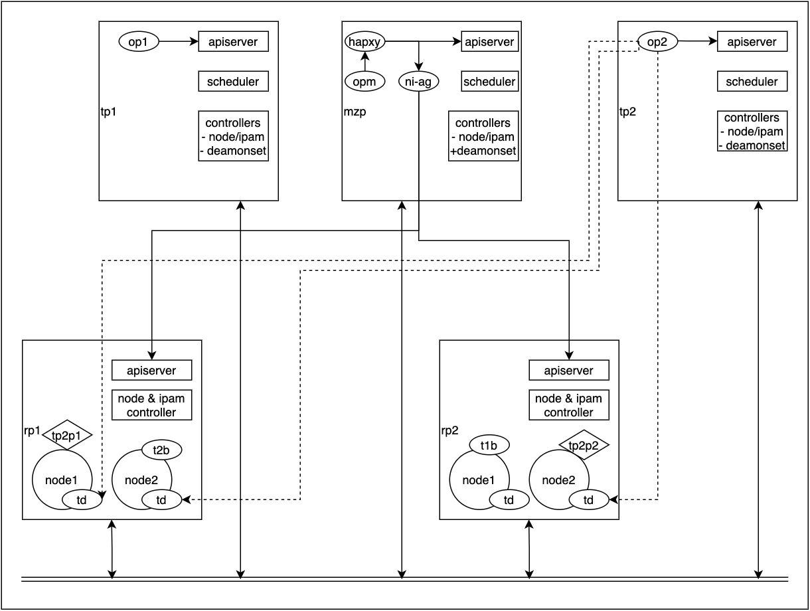

<!--
SPDX-License-Identifier: MIT
Copyright (c) 2021 The Authors.

Authors:
Vinay Kulkarni          <@vinaykul>
Phu Tran                <@phudtran>         

-->

# Mizar Pod Networking Design for Arktos Scaleout Architecture

## Introduction

Scaleout architecture of Arktos re-imagines the way Kubernetes processes are deployed with the goal of scaling beyond what is possible with a single Kubernetes cluster.

At a high level, this is achieved by deploying two different types Kubernetes clusters: resource partitions and tenant partitions.
  - Resource partitions are specialized Kubernetes clusters where apiserver and node controller manage a set of Nodes.
  - Tenant partitions are specialized Kubernetes clusters where apiserver, scheduler, and controllers manage a set of Pods for a particular tenant.

Kubelets on each node in each resource partition connect to apiservers of each tenant partition and watch for Pods scheduled to the node. 
Schedulers on each tenant partition connect to the apiservers of each resource partition and get a full view of all the nodes across all resource partitions, and the pods they host.

This way of partitioning effectively distributes pod and node management tasks and their etcd object store requirements across a larger set of resources and allows scaling beyond what a single cluster can do.

Scaleout architecture creates a very interesting problem for Pod Networking. Since each resource partition is effectively an 'isolated' Kubernetes cluster, we have two challenges:
 1. Available networking solutions that can be deployed in a cluster don't allow for communication of Pods belonging to a tenant across two or more resource partitions. 
 1. Available networking solutions don't provide network isolation between Pods belonging to different tenants in a resource partition. 

Mizar was built with multitenancy in mind and offers the ability to create VPCs and deploy pods in those VPCs. By default, Pods in a VPC cannot communicate with Pods in another VPC.
This natively provides strong network isolation for Pods in different VPCs without needing to rely on Kubernetes Network policies.

This design document explores the various design options to deploy Mizar in Arktos Scaleout cluster that leverages VPCs for pod isolation on per-tenant basis. It then proposes a design that can handle the scale required by Arktos scaleout architecture.


## Design Options for Arktos Scaleout Architecture

1. Deploy Mizar in each tenant partition as it is deployed in a scaleup cluster.
  - Pros:
    - In theory, each tenant would have networking for its own Pods and this is natively isolated from other tenant Pods as long as Geneve VNI is unique.
    - Pod information available from tenant-local apiserver, therefore little to no changes needed to the Mizar operator.
  - Cons:
    - Daemonset support needed in each tenant partition.
    - Each Mizar deployment will want to start its own transit daemon. Significant work needed to support multiple transit daemons.

2. Deploy Mizar in each resource partition.
  - Pros:
    - Each resource partition node gets exactly one transit daemon.
  - Cons:
    - Operator needs to connect to each tenant partition apiserver to see the pods that are scheduled.
    - VPC peering work needed to connect resource partitions so that pods across resource partitions are able to communicate.
    - Operator sees pods not scheduled to its nodes and needs to do extra work just to disregard them. Not very performant.

3. Deploy Mizar in a special tenant partition that supports daemonset controller. Deploy special Mizar operator for each tenant partition.
  - Pros:
    - Each resource partition node gets exactly one transit daemon.
    - Each tenant operator works for pods only belonging to that tenant partition and concerns itself with creating only tenant pod endpoints/interfaces.
    - This approach can scale well.
  - Cons:
    - Nodename field in the pod spec should be DNS resolvable name.

## Mizar Design Proposal for Scaleout Arktos

This section proposes the following design based on option 3 mentioned above.
The pros of option 3 outweigh the cons, and it may be implementable without too much development effort.

This design relies on few key changes:
  - A special Mizar partition that supports daemonset controller to enable Mizar daemon deployment on all nodes.
  - Mizar operator modified to aggregate nodes from all resource partitions by connecting to all rp apiservers.
  - A new per-tenant partition Mizar operator that watches Pods, Services etc created on a particular tenant partition and creates/deletes endpoints for those objects.

### Role of Mizar partition 

The special Mizar partition is deployed when scaleout cluster is deployed. The requirement is for Arktos to support daemonset controller in this partition.
This allows Mizar to deploy daemonset that runs transitd process on each node across all the resource partitions without any changes to Mizar daemon.
  - **Arktos Requirement: Arktos scaleout architecture needs to support daemonset controller in the Mizar partition.**

TODO: Can we use this project as a forcing function to convert Mizar operator to golang? (We may need more time than Jan 30 but it is the right thing to do)

#### Role of operator in Mizar partition 
Mizar operator that runs in Mizar partition does the following:
  - Uses the apiserver to get all object information except nodes.
  - Uses a list of apiservers to query node information.

We introduce a new component/process called node-information-aggregator that connects to all the resource partition apiservers, and queries node information.
In addition, we use haproxy to route non-node API calls to the apiserver while routing node information queries to the node-information-aggregator.

With these changes, the Mizar operator can function as it does today, and create default vpc, subnet, droplets, divider and bouncer interfaces taking into
account all the nodes across all the resource partitions.

In addition, Mizar partition is used to create VPCs and subnets as part of tenant partition creation workflow. This sets up the bouncers, dividers for
each VPC and is exclusive to the tenant the VPC is created for.

### Role of per-tenant Mizar operator

A new per-tenant Mizar operator is introduced as part of this design proposal. The per-tenant Mizar operator is responsible for connecting to its
tenant-local apiserver and watching the Pods, Services etc created/deleted on that tenant and taking actions based on the events. 

For example, when a pod is created and scheduled, the following actions are taken:
  - Use the nodeName field in the podSpec to resolve the node IP for thich the pod is destined, connect to the transit daemon on that node, and
    execute the RPC command to create interface for the new Pod.
    - **Arktos Requirement: Arktos scaleout architecture needs to ensure that DNS is configured so that nodeName can be resolved into node IP.**
  - Connect to the host that runs the bouncer for this Pod and execute the RPC command to tell the bouncer the host the new Pod is running on.

When a pod is deleted, the inverse opeartions to above are performed.

For performance reasons, this per-tenant Mizar operator is run locally on the master node that runs apiserver for the tenant. This is achieved via
addition of a manifest to create a static pod. The vpc, subnet, bouncer, divider information needed to create pod endpoints is passed to this operator
via config.

## Design Details and Workflow

The following diagram and the example workflow below illustrates how all of this comes together:



In this illustration, we have two resource partitions rp1 and rp2 containing two nodes node1 and node2. When the Mizar system tenant partition is deployed,
it creates a daemonset that deploys mizar daemon pods (transitd process) on each node in all resource partitions in the cluster.

_Note: We assume that any node in any resource partition can reach any other node in any other resource partition._

Once the transit daemons are up and running, they expose a server interface to configure various mizar objects such as endpoints (veth pairs), droplets, bouncers,
dividers etc. The daemonset controller is responsible for management of transit daemons on nodes that may join or leave, or restarting any daemons that may have
exited.

Mizar operator in the mizar partition (opm) needs node information from each resource partition so that it can connect to the transit daemons on those nodes and
create droplets and configure eBPF maps for various Mizar objects. To accomplish this, we add a new component called node-information-aggregator which connects
to all the apiservers in all resource partitions, and builds the NodeList. We can borrow the arktos scheduler code to accomplish this.

To achieve this, we can modify Mizar operator config load function to set _k8s_config.host from an OS defined environment variable instead of using
load_incluster_config() function. This points the operator to haproxy process that sends node specific requests to node-information-aggregator process, and all
other APIs are routed to the local apiserver. This allows operator to query aggregated nodes informaton, and create default vpc, subnet, droplets, divider and
bouncers for the default network.

Tenant partition creation workflow is modified to create a VPC unique to the tenant (e.g. tp2) by creating the VPC object in the Mizar partition. This results
in Mizar partition operator (opm) creating default subnet (if not specified), dividers and bouncers for this VPC.  In this illustration, rp1.node2 is marked as
the bouncer for tenant partition tp2 upon creation of VPC for tenant tp2.

This information is queried and passed via config to the new per-tenant Mizar operator that lives in the tenant-partition master node.

When pods are created by the tenant user (e.g tp2p1 and tp2p2), the scheduler of tp2 assigns them to nodes (say rp1.node1 and rp2.node2 respectively).
The per-tenant Mizar operator for tp2 (op2) watches this event, resolves their nodeName to the node IP, and invokes the endpoint creation interface on transit
daemons on the two nodes to create interfaces the pods will use to connect to the underlying Mizar network. It also tells the bouncer (t2b on rp1.node2) about
the two new pods that are connected to the Mizar network and the hosts they are running on. This allows the bouncer to route packets between the two pods.

Upon pod deletion, the inverse set of operations are performed.

Since each tenant has its own Mizar operator, and they execute a couple of RPC calls in response to pod creation and scheduling, it does not become a bottleneck
and this approach makes the design very scalable.


### Placing a pod into tenant VPC

A mutating admission plugin is added to Arktos. This plugin add annotations to pods created by the tenant user to allow the pod to be placed in the VPC for that tenant.

```yaml
apiVersion: v1
kind: Pod
metadata:
  name: nginx
  annotations:
    mizar.com/vpc: "vpc0"
spec:
  containers:
  - name: nginx
    image: nginx
    ports:
      - containerPort: 443
```

