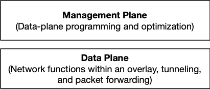

Welcome to Mizar - the open-source high-performance cloud-network powered by [ eXpress Data Path (XDP)](https://prototype-kernel.readthedocs.io/en/latest/networking/XDP/) and [Geneve protocol](https://tools.ietf.org/html/draft-ietf-nvo3-geneve-08) for high scale cloud.

Mizar is a simple and efficient solution that lets you create a multi-tenant overlay network of a massive number of endpoints with extensible network functions that:

* Support provisioning and management of large number endpoints
* Accelerate network resource provisioning for dynamic cloud environments
* Achieve high network throughput and low latency
* Create an extensible cloud-network of pluggable network functions
* Unifie the network data-plane for containers, serverless functions, virtual machines, etc
* Isolate multi-tenant's traffic and address space

## What is Mizar?

We think of Mizar as a server-less platform for networking functions, in which developers extend it with capabilities without compromising performance or scale.

The following diagram illustrates Mizar's high level architecture:

Mizar's [data-plane](design/data_plane.md) provides high performance and extensible packet processing pipeline and functions that achieves Mizar's functional, scale, and performance goals. Mizar's [management-plane](design/management_plane.md) programs the data-plane by translating typical networking related APIs and resources to Mizar specific configuration. The programability of the data-plane involves loading and unloading network functions at various stages of the packet processing pipeline.

## Overall Architecture

Mizar consists of a data-plane and a management plane. A control-plane also manages and programs the back-plane and data-plane. The back-plane comprises Geneve as the tunneling protocol between hosts and implements virtual network switching and routing that provides services to data-plane functions. The data-plane performs several network functions utilizing the essential elements of the data-plane. The following diagram summarizes the overall architecture and functional split.

